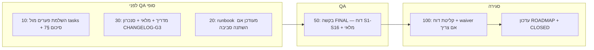

# M2 — תוכנית סגירה מלאה (צוות **100**)

**תאריך:** 2026-04-10  
**מוציא:** צוות **100** (תכנון סגירה)  
**נמענים:** צוותי **10, 20, 30, 50**, נימרוד (בעל מוצר)  
**עוגן קנוני:** [`M2-WORKPLAN-AND-MANDATES-2026-03-30.md`](./M2-WORKPLAN-AND-MANDATES-2026-03-30.md) **§11** · [`M2-WEEK0-CLOSEOUT-TEAM100-2026-03-29.md`](./M2-WEEK0-CLOSEOUT-TEAM100-2026-03-29.md) · [`docs/project/ROADMAP-2026.md`](../../docs/project/ROADMAP-2026.md)  
**עץ אתר נעול (IA):** [`hub/data/site-tree.json`](../../hub/data/site-tree.json) — `treeApprovedDocRef` (אישור אייל 2026-04-06).

---

## סטטוס ביצוע (עדכון 2026-04-06)

**§11 — נסגר.** צוות **100** קלט את **G4** וסגר את DoD לפי [`M2-G4-ACCEPTANCE-M2-CLOSEOUT-TEAM100-2026-04-06.md`](./M2-G4-ACCEPTANCE-M2-CLOSEOUT-TEAM100-2026-04-06.md): דוח FINAL [`M2-SMOKE-REPORT-FINAL-2026-04-06-v2.md`](../team_50/M2-SMOKE-REPORT-FINAL-2026-04-06-v2.md) — **PASS WITH NOTES** (**F2** בלבד, לפרודקשן / M7 לפי שבוע 0); [`M2-WORKPLAN-AND-MANDATES-2026-03-30.md`](./M2-WORKPLAN-AND-MANDATES-2026-03-30.md) §11 מסומן **CLOSED**; [`docs/project/ROADMAP-2026.md`](../../docs/project/ROADMAP-2026.md) — **M2 = COMPLETED**, **M3 = IN_PROGRESS**; Hub (`hub/data/roadmap.json`, `tasks.json`, `updates.json`) מסונכרן.

מסמך זה נשאר **תכנית קנונית** לנתיב הסגירה; לעובדה המעודכנת בפרויקט ראו מסמך הקבלה, M2-WORKPLAN §11 והרודמאפ.

---

## 0. מדיניות סביבה (נעולה — בעל מוצר)

- **כל העבודה הנוכחית מול סטייג’ינג** עד שהאתר שלם מבחינת תוכן ועמודים; **רק אז** מעבר ל־**פרודקשן**.  
- אין לבלבל בין בדיקות סטייג’ינג לבין cutover — ראו [`STAGING-TLS-VS-PRODUCTION-WORKFLOW-2026-04-02.md`](../team_20/STAGING-TLS-VS-PRODUCTION-WORKFLOW-2026-04-02.md).

### 0.1 סטייה מתועדת מ־M2-WORKPLAN §7 (חנות / P22)

ב־**עץ האתר הנעול** אין **עמוד חנות** (`/shop/`). המבנה הסופי: **כפתורי סליקה חיצוניים** (דוגמאות שסופקו לצוות) — לא WooCommerce / עמוד קטלוג חנות בתפריט.  
מלאי עמודים ל־QA ולסגירת G2 נמדד מול **`site-tree.json`**, לא מול שורת **P22** בטבלת §7 הישנה במסמך התכנון — כדי שלא יידרש «חנות» שלא בתכנון.

---

## 1. מטרה

להגדיר **נתיב סגירה אחיד** של **M2 — הקמת אתר רזה** עד עמידה מלאה ב־**Definition of Done §11**, קבלת **דוח QA FINAL** מצוות **50**, ועדכון **רודמאפ** + סימון **M2-WORKPLAN כ־CLOSED** — **בלי** לפתוח רשמית את **M3** לפני השלמת השורה האחרונה ב־§11 (חוק **F1**).

**עדכון ביצוע:** נכון ל־**2026-04-06** הנתיב יושם — §11 **CLOSED**, **M3** נפתח ברודמאפ לאחר עמידה ב־F1; פירוט בתחילת המסמך תחת **סטטוס ביצוע**.

---

## 2. תנאי סגירה (מיפוי ל־§11)

| שורת §11 | בעלים ראשי | מה נסגר | ארטיפקט / הוכחה |
|-----------|------------|---------|------------------|
| **G0** — דוח 90 + C1–C4 | 100 | דוח 90 **PASS** או **PASS WITH CONDITIONS** + **CONDITIONS_MET** חתום בראש M2-WORKPLAN | דוח 90 במאגר; שורת CONDITIONS_MET ✓ |
| **G1** — runbook 20 | 20 → 10 | Runbook כולל **20.3a, 20.3b, 20.11, 20.5a** + handoff | [`M2-RUNBOOK-ENV-2026-03-31.md`](../team_20/M2-RUNBOOK-ENV-2026-03-31.md) + handoff 20→10 |
| **G2** — סיכום 10 | 10 | טבלת מימוש מול **עץ נעול** (`site-tree.json`) — כל הצמתים הנדרשים ל־M2 (ללא חנות) + **`GREEN_INVOICE_STATUS`** | [`M2-IMPLEMENTATION-SUMMARY-2026-04-01.md`](../team_10/M2-IMPLEMENTATION-SUMMARY-2026-04-01.md) מעודכן לסגירה |
| **G3** — תיעוד 30 | 30 (+ סנכרון 10) | מדריך מפעיל + מלאי תוספים + **30.1** מול **CHANGELOG-G3** | `team_30/M2-OPERATOR-GUIDE-*.md`, `M2-PLUGIN-INVENTORY-*.md` · התאמה לסיכום 10 |
| **G4** — QA 50 | 50 | דוח **FINAL** — **PASS** או **PASS WITH NOTES** (רק **F2** מסירת מייל לפרודקשן, לפי שבוע 0) | דוח FINAL תחת `team_50/` — ראו בקשה ייעודית: [`M2-FINAL-QA-REQUEST-M2-CLOSEOUT-TEAM50-2026-04-10.md`](../team_50/M2-FINAL-QA-REQUEST-M2-CLOSEOUT-TEAM50-2026-04-10.md) |
| **100** — רודמאפ + CLOSED | 100 | `ROADMAP-2026.md`: **M2 = COMPLETED**, **M3** רק אחרי ✓; כותרת/סעיף §11: **CLOSED** | עדכון `docs/project/ROADMAP-2026.md` + סימון M2-WORKPLAN |

### 2.1 טופס צור קשר (§11.1 — שבוע 0)

- **בסטייג'ינג (M2):** מספיק מימוש בסיסי + תיעוד בדוח 50 (כולל **F2** אם רלוונטי).  
- **בפרודקשן:** אימות מלא של מייל — **לא** חוסם סגירת M2 — ראו [`M2-WEEK0-CLOSEOUT-TEAM100-2026-03-29.md`](./M2-WEEK0-CLOSEOUT-TEAM100-2026-03-29.md) §2.

---

## 3. רצף ביצוע מומלץ (עד סגירה)

| שלב | פעולה | אחראי | הערות |
|-----|--------|-------|--------|
| **A** | סגירת פערים מ־[`hub/data/tasks.json`](../../hub/data/tasks.json) (ייבוא WXR, קריאה, תפריטים, EN, צור קשר, Yoast P15, וכו') מול §7 | 10 | לעדכן `stateHe` / סטטוס במשימות; לסנכרן סיכום יישום |
| **B** | וידוא **G3** מול גרסת סטייג'ינג הנוכחית | 30 + 10 | לפי §9.3 **30.1** |
| **C** | **מנדט QA מרוכז יחיד ל־50** | 100 / 10 (מוציא טכני) | **[`M2-QA-CONSOLIDATED-MANDATE-TEAM50-2026-04-10.md`](../team_50/M2-QA-CONSOLIDATED-MANDATE-TEAM50-2026-04-10.md)** (נספח: [`M2-FINAL-QA-REQUEST-M2-CLOSEOUT-TEAM50-2026-04-10.md`](../team_50/M2-FINAL-QA-REQUEST-M2-CLOSEOUT-TEAM50-2026-04-10.md)) |
| **D** | תיקוני P0/P1 מתוצאות 50 (אם יש) + **ריטסט** עד PASS או PASS WITH NOTES | 10 + 50 | מעגלים קצרים; תיעוד בדוח 50 |
| **E** | קבלת **דוח FINAL** חתום מ־50 | 100 | אם FAIL — לא לסגור M2 עד תכנית תיקון |
| **F** | עדכון **ROADMAP**; סימון **§11** ו־**M2-WORKPLAN CLOSED** | 100 | רק אחרי שורה G4 ✓ |

---

## 4. פלטים נדרשים לפני «סגור M2»

1. דוח צוות **50** במצב **FINAL** עם **PASS** או **PASS WITH NOTES** (מדיניות F2).  
2. `M2-IMPLEMENTATION-SUMMARY` עם טבלת §7 מלאה ו־`GREEN_INVOICE_STATUS`.  
3. מדריך מפעיל + מלאי תוספים (30) מסונכרנים.  
4. רודמאפ מעודכן (גרסה/תאריך) — M2 **COMPLETED**.

---

## 5. החלטות נעולות (מפגישה / בעל מוצר — עדכון 2026-04-10)

| # | נושא | החלטה |
|---|------|--------|
| 1 | **סביבה** | כל העבודה כרגע **מול סטייג’ינג הנוכחי** עד אתר מלא בתוכן ובעמודים; **אז** פריסה ל־**פרודקשן** (§0). |
| 2 | **חנות** | **אין חנות** בעץ הנעול — רק **כפתורים** (דוגמאות שסופקו); אין דרישת עמוד `/shop/` או P22 כב§7 הישן (§0.1). |
| 3 | **קורסים** | קיים בעץ הצומת **`st-courses`** — «קורסים (סקולר / חיצוני)», `slug: courses-external`, תחת **לימוד והכשרה** (`st-learning-hub`), תבנית **`tpl-external-menu`**. בדיקת תפריט = קישור חיצוני תקף / מוקאף מאושר — לא «בעיה» של היעדר עמוד פנימי. |
| 4 | **דף בית** | **נעול ואושר (2026-04-06):** מוקאף **`home-visual-sketch-final-rtl.html`** + החלטות Hub (**D-EYAL-HOME-01** וכו’) — ראו `treeApprovedDocRef` ו־`st-home` ב־`site-tree.json`. מבנה בלוקים ותבנית WP — לפי זה; **טקסטים שיווקיים** נשארים בקליטת תוכן. |
| 5 | **נגישות** | לדעת בעל המוצר: **סגור ברמת תשתית** — לאמת מול [`M2-WP-ACCESSIBILITY-CONFIG-AND-QA-2026-04-09.md`](../team_10/M2-WP-ACCESSIBILITY-CONFIG-AND-QA-2026-04-09.md) בדוח 50; **שאריות** (תוכן, ניגודיות אחרי שינויי טקסט) — **M3 / M5** לפי צוות 100. |

---

## 6. קישורים מהירים

| נושא | קישור |
|------|--------|
| קבלת G4 + סגירת §11 (100, ביצוע) | [`M2-G4-ACCEPTANCE-M2-CLOSEOUT-TEAM100-2026-04-06.md`](./M2-G4-ACCEPTANCE-M2-CLOSEOUT-TEAM100-2026-04-06.md) |
| בקשת QA FINAL (חדש) | [`../team_50/M2-FINAL-QA-REQUEST-M2-CLOSEOUT-TEAM50-2026-04-10.md`](../team_50/M2-FINAL-QA-REQUEST-M2-CLOSEOUT-TEAM50-2026-04-10.md) |
| בריף G2 מקורי | [`../team_50/M2-G2-QA-BRIEF-FOR-TEAM50-2026-03-29.md`](../team_50/M2-G2-QA-BRIEF-FOR-TEAM50-2026-03-29.md) |
| GO קליטת תוכן (תשתית) | [`M2-CONTENT-INTAKE-INFRASTRUCTURE-GO-TEAM100-2026-04-08.md`](./M2-CONTENT-INTAKE-INFRASTRUCTURE-GO-TEAM100-2026-04-08.md) |
| משימות Hub (מראה) | [`../../hub/data/tasks.json`](../../hub/data/tasks.json) |

---

*סוף תוכנית סגירה — צוות 100. §11 נסגר ב־2026-04-06 (מסמך קבלה לעיל). עדכון מקורי לפי החלטות פגישה / תוצאות דוח 50.*
