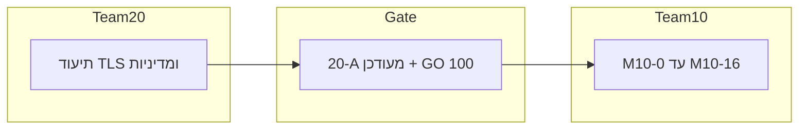

# M2 G2 — אינדקס סדר מנדטים (20 → 10)

**מוציא:** צוות **100**  
**תאריך:** 2026-04-02  
**עדכון:** תיקון שער **20-A** + **GO** ל־10 — [`M2-GATE-20A-AMENDMENT-AND-GO-TEAM10-2026-04-02.md`](./M2-GATE-20A-AMENDMENT-AND-GO-TEAM10-2026-04-02.md)  
**עדכון 2026-04-04:** אחרי דוח QA צוות 50 — יישום **חלק צוות 100** במאגר הושלם; המשך **סטייג'ינג P0** — צוות 10 בלבד — [`M2-QA-REMEDIATION-AND-RETEST-PLAN-2026-04-04.md`](./M2-QA-REMEDIATION-AND-RETEST-PLAN-2026-04-04.md) · [`../team_10/M2-G2-STAGING-P0-COMPLETION-2026-04-04.md`](../team_10/M2-G2-STAGING-P0-COMPLETION-2026-04-04.md)

**תפקיד מסמך זה:** קישור ל־**שני מנדטים נפרדים** — אחד לכל צוות. אין לערבב תוכן מנדט לתוך מסמך זה; כל צוות מבצע **רק** מהקובץ שלו.

---

## קבצי מנדט (קנוניים)

| צוות | קובץ המנדט |
|------|------------|
| **20** (קודם — תיעוד תשתית / שער מעודכן) | [`../team_20/M2-MANDATE-G2-PREREQ-TEAM20-2026-04-02.md`](../team_20/M2-MANDATE-G2-PREREQ-TEAM20-2026-04-02.md) |
| **10** (אחרי GO מ־100) | [`../team_10/M2-MANDATE-G2-TEAM10-2026-04-02.md`](../team_10/M2-MANDATE-G2-TEAM10-2026-04-02.md) |

---

## כללי רצף (מעודכן)

| כלל | פירוט |
|-----|--------|
| **20** | משלים מסלול TLS מתועד + דוח ל־100 — ראו [`../team_20/M2-INFRA-COMPLETION-REPORT-TO-TEAM100-2026-04-01.md`](../team_20/M2-INFRA-COMPLETION-REPORT-TO-TEAM100-2026-04-01.md) · [`../team_20/STAGING-TLS-VS-PRODUCTION-WORKFLOW-2026-04-02.md`](../team_20/STAGING-TLS-VS-PRODUCTION-WORKFLOW-2026-04-02.md) |
| **100** | תיקון פורמלי לשער 20-A + **GO** — [`M2-GATE-20A-AMENDMENT-AND-GO-TEAM10-2026-04-02.md`](./M2-GATE-20A-AMENDMENT-AND-GO-TEAM10-2026-04-02.md) |
| **10** | **אינו** חסום על ידי `curl` בלי `-k` על סטייג'ינג; **כן** מתעד הבדלה סטייג'ינג/פרודקשן; TLS מלא **בפרודקשן** לפני השקה (M7) |
| **תיאום** | אופציונלי: [`STAGING-CHANNEL-STATUS-2026-03-31.md`](../team_20/STAGING-CHANNEL-STATUS-2026-03-31.md) |

---

## ציר זמן (תזמון)

---

**מקור תכנון מלא:** [`M2-WORKPLAN-AND-MANDATES-2026-03-30.md`](./M2-WORKPLAN-AND-MANDATES-2026-03-30.md) §5–§6.
