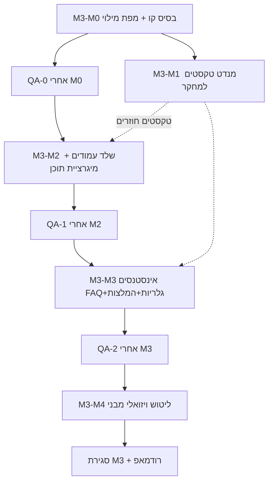

# M3 — תוכנית ביצוע ומנדטים (צוות **100**)

**תאריך:** 2026-04-07  
**מוציא:** צוות **100**  
**נמענים:** צוותי **10, 20, 30, 50**, נימרוד (בעל מוצר), צוות מחקר (טקסטים זמניים)  
**הקשר:** לאחר סגירת **M2** (§11, 2026-04-06) — ראו `[M2-G4-ACCEPTANCE-M2-CLOSEOUT-TEAM100-2026-04-06.md](./M2-G4-ACCEPTANCE-M2-CLOSEOUT-TEAM100-2026-04-06.md)`.  
**מסמך לווי (טקסטים חסרים):** `[M3-TEXT-PLACEHOLDER-REQUIREMENTS-FOR-RESEARCH-2026-04-07.md](./M3-TEXT-PLACEHOLDER-REQUIREMENTS-FOR-RESEARCH-2026-04-07.md)`

---

## 0. יעד שלב, מקור אמת, Hub — נוהל עבודה (קנון)

**יעד השלב הטכני (מול מפת דרכים):** תשתית **מוכנה במלואה** לפי **עץ האתר** ו**מבנה דף הבית שננעלו** — כך שניתן יהיה **לקלוט במהירות** את כל תכונות האתר כשיגיעו **עיצוב סופי** ו**תכנים מלאים מהלקוח**. אין להחליף יעד זה בייצור מסמכים נוספים.

**מקור אמת יחיד לניהול אורקסטרציה (צוות 100):** **מסמך זה** — טבלת **«מעקב אורקסטרציה»** למטה + **§4** (אינדקס מסמכים). על **כל סיום צוות** נקלט **דוח השלמה** ומעודכנות כאן השורות הרלוונטיות (סטטוס, משוב, **מנדטים הבאים**). **אין** לפתוח במקביל «חבילות סיכום» / handoff packs חדשים שחוזרים על אותו יומן — רק **מנדט או החלטה נפרדים** כשיש צורך בחוזה ביצוע או בחתימת QA.

**תבנית משוב חובה (לצוותים ולנימרוד):** בכל מסירה מצוות 100 — **מה** (מנדט / פרומפט / ארטיפקט) מועבר **עכשיו**, **לאיזה צוות**; אם אינו ברור — **שתיים–שלוש אופציות** להחלטה.

**Hub (`hub/data/`, בנייה ל־`hub/dist/`):** זה **תצוגת סטטוס לאייל** על הפרויקט — **לא** מקור עבודה יומיומי. **עדכון אחד** ב־`updates.json` (וסנכרון `tasks.json` / `roadmap.json` רק כשנדרש) **בסוף כל שלב משמעותי** — לא אחרי כל צעד משני. פירוט מלא נשאר **כאן** ביומן.

**אורקסטרציה (צוות 100):** אנחנו מנהלים את רצף M3 לפי §0: בכל צעד מוצגים **קישורים למנדטים הבאים**; נקלט **משוב מנימרוד** ומעודכן **יומן המעקב** למטה. **חבילת צוות 80 התקבלה (2026-04-06)** — ראו `[../team_80/M3-TEXT-PLACEHOLDER-RETURN-TEAM80-2026-04-06.md](../team_80/M3-TEXT-PLACEHOLDER-RETURN-TEAM80-2026-04-06.md)` + JSON + MU + עדכון תבנית בית במאגר.

**M4 — Wave1 (תוכן־עיצוב, 2026-04-09):** מסלול מימוש פעיל תחת אבן דרך M4 — נעילת תבנית ספר, עמוד ייחוס, שכפול, `st-books`, טיפולים, פריסה; **אינו** מחליף את יומן M3 אלא משקף ב־Hub (`updates.json`, `roadmap.json`, `tasks.json`) ומסמך `[M4-CONTENT-IMPLEMENTATION-ROUND-FROM-EYAL-CONTENT-2026-04-09.md](./M4-CONTENT-IMPLEMENTATION-ROUND-FROM-EYAL-CONTENT-2026-04-09.md)`.

---

## מעקב אורקסטרציה — יומן משוב ושערים

| חבילה / שלב                 | סטטוס                                                                                                                                                                                                                                                                                                                                                                                                          | משוב נימרוד (תמצית)                                                                                                                                                                               | מנדטים הבאים (לאחר סיום)                                                                                                                                                                                                                                                                                                                                                                                                                                                                                                                                                                                                                                                                                                                                                                                                                                                                                                                                                                                                                                                                                                                                                                                                                |
| --------------------------- | -------------------------------------------------------------------------------------------------------------------------------------------------------------------------------------------------------------------------------------------------------------------------------------------------------------------------------------------------------------------------------------------------------------- | ------------------------------------------------------------------------------------------------------------------------------------------------------------------------------------------------- | --------------------------------------------------------------------------------------------------------------------------------------------------------------------------------------------------------------------------------------------------------------------------------------------------------------------------------------------------------------------------------------------------------------------------------------------------------------------------------------------------------------------------------------------------------------------------------------------------------------------------------------------------------------------------------------------------------------------------------------------------------------------------------------------------------------------------------------------------------------------------------------------------------------------------------------------------------------------------------------------------------------------------------------------------------------------------------------------------------------------------------------------------------------------------------------------------------------------------------------- |
| **צוות 80 — טקסטים זמניים** | **שולב במאגר** (2026-04-06 מסירה)                                                                                                                                                                                                                                                                                                                                                                              | —                                                                                                                                                                                                 | MD: `[../team_80/M3-TEXT-PLACEHOLDER-RETURN-TEAM80-2026-04-06.md](../team_80/M3-TEXT-PLACEHOLDER-RETURN-TEAM80-2026-04-06.md)` · JSON: `[../team_10/M3-TEXT-PLACEHOLDER-RETURN-TEAM80-2026-04-06.bundle.json](../team_10/M3-TEXT-PLACEHOLDER-RETURN-TEAM80-2026-04-06.bundle.json)` · MU: `site/wp-content/mu-plugins/ea-m3-team80-placeholder-content-once.php`                                                                                                                                                                                                                                                                                                                                                                                                                                                                                                                                                                                                                                                                                                                                                                                                                                                                        |
| **חבילה 1** (M3-M0 + 1b)    | **סגור** (2026-04-07) — כולל **QA-0**                                                                                                                                                                                                                                                                                                                                                                          | ראו **קליטת משוב צוות 10** + **דוח QA-0** למטה                                                                                                                                                    | —                                                                                                                                                                                                                                                                                                                                                                                                                                                                                                                                                                                                                                                                                                                                                                                                                                                                                                                                                                                                                                                                                                                                                                                                                                       |
| **חבילה 2** (M3-M2 + QA-1)  | **סגורה לשער QA-1** (2026-04-07) · `**PASS WITH NOTES`**                                                                                                                                                                                                                                                                                                                                                       | הערת שער: **Q1-6** (כפילויות REST) — **פתוח מול 100** עד החלטה או waiver לפני **QA-2 FINAL**                                                                                                      | —                                                                                                                                                                                                                                                                                                                                                                                                                                                                                                                                                                                                                                                                                                                                                                                                                                                                                                                                                                                                                                                                                                                                                                                                                                       |
| **חבילה 3** (M3-M3 + QA-2)  | **סגורה לשער QA-2** (2026-04-07) · `**PASS WITH NOTES`** · **Q1-6 טכני** — **מימוש במאגר**; **ריטסט 50 + G5–G7 + R1–R4** (2026-04-08) — `[M3-G5G7-R1R4-EXECUTION-MANDATE-TEAM10-2026-04-08.md](../team_10/M3-G5G7-R1R4-EXECUTION-MANDATE-TEAM10-2026-04-08.md)` · `[M3-QA-INSTANCES-GALLERIES-REPORT-RETEST-TEAM50-2026-04-08.md](../team_50/M3-QA-INSTANCES-GALLERIES-REPORT-RETEST-TEAM50-2026-04-08.md)` | **waiver מוגבל (100):** `[M3-Q1-6-WAIVER-PARALLEL-M4-GATE-TEAM100-2026-04-08.md](./M3-Q1-6-WAIVER-PARALLEL-M4-GATE-TEAM100-2026-04-08.md)` — מקביל **M4**; **אין GO מלא M3-M4** מטעם 50 לפי ריטסט | **סגירת M3** (100) / **M5** — **חבילה 4** (M3-M4+QA-M4) כבר פורסמה; ראו שורת **חבילה 4**                                                                                                                                                                                                                                                                                                                                                                                                                                                                                                                                                                                                                                                                                                                                                                                                                                                                                                                                                                                                                                                                                                                                                                                                     |
| **חבילה 4** (M3-M4 + QA-M4) | **פורסמה** (2026-04-08) · **QA-M4** סגור **PASS** (ריטסט קנוני 2026-04-07) · דוח ראשון: **PASS WITH NOTES** · תיקוני **10** + הגשה חוזרת (תמה **1.3.1**)                                                                                                                                                                                                                                                       | —                                                                                                                                                                                                 | **M3 טכני** — **סגור** (2026-04-07) — §«סגירת M3 טכנית סופית»; **המשך:** **M4** אינטגרציות + יישום **DEFERRED** מתיק governance; **M5** ליטוש                                                                                                                                                                                                                                                                                                                                                                                                                                                                                                                                                                                                                                                                                                                                                                                                                                                                                                                                                                                                                                                                                                                                                         |
| **QA-0**                    | **סגור** (2026-04-07) · `**PASS WITH NOTES`**                                                                                                                                                                                                                                                                                                                                                                  | הערות: כפילויות REST ויישור slug — כבר במטריצה; בעלות **10** / **100** ב־**M3-M2**                                                                                                                | דוח **FINAL:** `[../team_50/M3-QA-0-BASELINE-MATRIX-REPORT-2026-04-07.md](../team_50/M3-QA-0-BASELINE-MATRIX-REPORT-2026-04-07.md)` · מנדט: `[../team_50/M3-QA-0-BASELINE-MATRIX-MANDATE-TEAM50-2026-04-07.md](../team_50/M3-QA-0-BASELINE-MATRIX-MANDATE-TEAM50-2026-04-07.md)` · קליטה מ־10: `[../team_10/M3-QA-0-READINESS-REQUEST-TEAM10-2026-04-07.md](../team_10/M3-QA-0-READINESS-REQUEST-TEAM10-2026-04-07.md)` · **אימות תיעוד חוזר (ללא curl):** `[../team_50/M3-QA-0-DOC-SYNC-RETEST-TEAM50-2026-04-07.md](../team_50/M3-QA-0-DOC-SYNC-RETEST-TEAM50-2026-04-07.md)`                                                                                                                                                                                                                                                                                                                                                                                                                                                                                                                                                                                                                                                         |
| **QA-1**                    | **סגור** (2026-04-07) · `**PASS WITH NOTES`**                                                                                                                                                                                                                                                                                                                                                                  | **Q1-6:** כפילויות REST (`lectures`, `sound-healing`, `workshops`) — **פתוח מול 100**                                                                                                             | דוח **FINAL:** `[../team_50/M3-QA-PAGES-CONTENT-REPORT-TEAM50-2026-04-07.md](../team_50/M3-QA-PAGES-CONTENT-REPORT-TEAM50-2026-04-07.md)` · מנדט: `[../team_50/M3-QA-PAGES-CONTENT-MANDATE-TEAM50-2026-03-29.md](../team_50/M3-QA-PAGES-CONTENT-MANDATE-TEAM50-2026-03-29.md)` · קליטה מ־10: `[../team_10/M3-QA-1-READINESS-REQUEST-TEAM10-2026-04-01.md](../team_10/M3-QA-1-READINESS-REQUEST-TEAM10-2026-04-01.md)` · **אימות תיעוד חוזר (ללא curl):** `[../team_50/M3-QA-1-DOC-SYNC-RETEST-TEAM50-2026-04-07.md](../team_50/M3-QA-1-DOC-SYNC-RETEST-TEAM50-2026-04-07.md)`                                                                                                                                                                                                                                                                                                                                                                                                                                                                                                                                                                                                                                                           |
| **QA-2**                    | **סגור** (2026-04-07) · `**PASS WITH NOTES`** · **דוח בסיס 04-07 (ללא שינוי):** שורת שער **Q1-6 / waiver: לא התקיים** · **ריטסט 2026-04-08:** **Q1-6 + Q2-2…Q2-6** — `**PASS WITH NOTES`** · **אישור GO מלא M3-M4 מ־50** — **לא מאושר** (לפי דוח הריטסט) · **קליטת 100:** שער טכני הריטסט **סגור**; הערות נסגרו מול **10**                                                                                                                                                                                                  | **100 (2026-04-08):** **קליטת ריטסט סופית** — אין חסימה פתוחה מסקופ הבקשה · **waiver מקביל** — `[M3-Q1-6-WAIVER-PARALLEL-M4-GATE-TEAM100-2026-04-08.md](./M3-Q1-6-WAIVER-PARALLEL-M4-GATE-TEAM100-2026-04-08.md)` — **אינו** מבטל דוח בסיס 04-07        | דוח **FINAL (בסיס):** `[../team_50/M3-QA-INSTANCES-GALLERIES-REPORT-TEAM50-2026-04-07.md](../team_50/M3-QA-INSTANCES-GALLERIES-REPORT-TEAM50-2026-04-07.md)` · **ריטסט FINAL:** `[../team_50/M3-QA-INSTANCES-GALLERIES-REPORT-RETEST-TEAM50-2026-04-08.md](../team_50/M3-QA-INSTANCES-GALLERIES-REPORT-RETEST-TEAM50-2026-04-08.md)` · מנדט: `[../team_50/M3-QA-INSTANCES-GALLERIES-MANDATE-TEAM50-2026-04-08.md](../team_50/M3-QA-INSTANCES-GALLERIES-MANDATE-TEAM50-2026-04-08.md)` · קליטה מ־10: `[../team_10/M3-QA-2-READINESS-REQUEST-TEAM10-2026-04-01.md](../team_10/M3-QA-2-READINESS-REQUEST-TEAM10-2026-04-01.md)` · **הגשה חוזרת:** `[../team_10/M3-QA-2-READINESS-RESUBMISSION-TEAM10-2026-04-08.md](../team_10/M3-QA-2-READINESS-RESUBMISSION-TEAM10-2026-04-08.md)` · פריסה: `[../team_10/M3-QA-2-STAGING-DEPLOY-VERIFY-TEAM10-2026-04-01.md](../team_10/M3-QA-2-STAGING-DEPLOY-VERIFY-TEAM10-2026-04-01.md)` · **DOC-SYNC:** `[../team_50/M3-QA-2-DOC-SYNC-RETEST-TEAM50-2026-04-07.md](../team_50/M3-QA-2-DOC-SYNC-RETEST-TEAM50-2026-04-07.md)` — `**PASS`** · **ריטסט מוכנות (2026-04-08):** `[../team_10/M3-QA-2-READINESS-REQUEST-TEAM10-2026-04-08.md](../team_10/M3-QA-2-READINESS-REQUEST-TEAM10-2026-04-08.md)` |
| **QA-M4**                   | **סגור** (2026-04-07) · **PASS** (ריטסט קנוני) · דוח ראשון: **PASS WITH NOTES**                                                                                                                                                                                                                                                                                                                                | **Audit לא־חוסם:** מחרוזת GP cached עם `#1e73be` במקור — ללא פער QA פתוח (ראו ריטסט §מסקנה)                                                                                                       | מנדט: `[../team_50/M3-QA-M4-VISUAL-NOTE-MANDATE-TEAM50-2026-04-08.md](../team_50/M3-QA-M4-VISUAL-NOTE-MANDATE-TEAM50-2026-04-08.md)` · READINESS: `[../team_10/M3-QA-M4-READINESS-REQUEST-TEAM10-2026-04-01.md](../team_10/M3-QA-M4-READINESS-REQUEST-TEAM10-2026-04-01.md)` · דוח 1: `[../team_50/M3-QA-M4-VISUAL-NOTE-REPORT-TEAM50-2026-04-07.md](../team_50/M3-QA-M4-VISUAL-NOTE-REPORT-TEAM50-2026-04-07.md)` · הגשה חוזרת **10:** `[../team_10/M3-QA-M4-READINESS-RESUBMISSION-TEAM10-2026-04-07.md](../team_10/M3-QA-M4-READINESS-RESUBMISSION-TEAM10-2026-04-07.md)` · **ריטסט:** `[../team_50/M3-QA-M4-VISUAL-NOTE-RETEST-TEAM50-2026-04-07.md](../team_50/M3-QA-M4-VISUAL-NOTE-RETEST-TEAM50-2026-04-07.md)`                                                                                                                                                                                                                                                                                                                                                                                                                                                                                                                  |

---

## קליטת משוב צוות **50** (2026-04-07) — בדיקה חוזרת תיעוד (אחרי עדכון 100)

**בוצע:** אימות קישורים ותיעוד בלבד — **ללא** הרצה חוזרת של Q0-4/Q0-5 (curl / REST מול סטייג’ינג).

**פלט:** `[../team_50/M3-QA-0-DOC-SYNC-RETEST-TEAM50-2026-04-07.md](../team_50/M3-QA-0-DOC-SYNC-RETEST-TEAM50-2026-04-07.md)` — **PASS** (D1–D7): דוח FINAL קיים וללא שינוי נדרש; אין במאגר הפניות לשם ישן `…REPORT-TEAM50-…` ל־M3-QA-0; `M3-EXECUTION-PLAN`, `M3-QA-0-READINESS-REQUEST`, `M3-M0-FILL-MATRIX-MANDATE`, וסעיף ביצוע במנדט 50 — מתואמים לדוח ול־`**PASS WITH NOTES`**.

---

## קליטת משוב צוות **10** (2026-04-07) — סיכום M3-M0 + 1b

**QA-0 הושלם בצוות 50** — דוח **FINAL** `[../team_50/M3-QA-0-BASELINE-MATRIX-REPORT-2026-04-07.md](../team_50/M3-QA-0-BASELINE-MATRIX-REPORT-2026-04-07.md)` · `**PASS WITH NOTES`** (Q0-1–Q0-5 עברו; הערות — כפילויות REST ויישור slug, מתועדות במטריצה, בעלות 10/100 ל־M3-M2). **חבילה 2** פורסמה (2026-03-29): מנדט **M3-M2** `[../team_10/M3-M2-PAGES-CONTENT-MANDATE-TEAM10-2026-03-29.md](../team_10/M3-M2-PAGES-CONTENT-MANDATE-TEAM10-2026-03-29.md)` · מנדט **QA-1** `[../team_50/M3-QA-PAGES-CONTENT-MANDATE-TEAM50-2026-03-29.md](../team_50/M3-QA-PAGES-CONTENT-MANDATE-TEAM50-2026-03-29.md)` — ראו **§2.2**.

**קליטת מסירת צוות 10 (לפני QA-0):**

1. `**M3-PAGE-FILL-MATRIX-2026-04-07.md` — v1 מלא:** 35 שורות מול 35 צמתים ב־`hub/data/site-tree.json`. מולאו סטטוס WP (חי / אין / N/A), סטטוס תוכן (legacy / חלקי / PLACEHOLDER + R#), legacy עם URL מלאים (כולל `?p=` ו־SSOT), הערות (כפילויות REST, M2, DEFERRED ל־`st-book-tsva`). **4× N/A:** `st-blog-post`, `st-extra-pages`, `st-gallery-cms`, `st-404`. **1× אין:** `st-html-sitemap` (אופציונלי, לא ב־M2). נספח ספירה בתחתית המטריצה.
2. **בדיקת עצמית (מול QA-0):** Q0-1–Q0-3 אומתו בסקריפט Python מקומי; Q0-4/Q0-5 — חמש דגימות + `curl -L` לסטייג’ינג — 200 (בית דרך הפניה מ־`/home/`).
3. **בקשת QA קנונית ל־50:** `[../team_10/M3-QA-0-READINESS-REQUEST-TEAM10-2026-04-07.md](../team_10/M3-QA-0-READINESS-REQUEST-TEAM10-2026-04-07.md)` — קישור למנדט QA-0, טבלת עצמי, דגימת 5 צמתים, שם קובץ דוח מוצע.
4. **אורקסטרציה:** שורות חבילה 1 ו־QA-0 בעמוד זה מסונכרנות עם סגירת **QA-0** (`**PASS WITH NOTES`**, דוח FINAL).
5. **סגירת מנדט M3-M0:** `[../team_10/M3-M0-FILL-MATRIX-MANDATE-TEAM10-2026-04-07.md](../team_10/M3-M0-FILL-MATRIX-MANDATE-TEAM10-2026-04-07.md)` — סעיף ביצוע עם קישורים.

---

## קליטת עבודת צוות **10** (2026-04-01) — חבילת מאגר **M3-M2**

**פורסם במאגר (לא מחליף ביצוע סטייג’ינג):** תיק החלטות **100** · רשימת ביצוע סטייג’ינג · מטריצה **v2** (נספחים B–D) · בקשת **QA-1** טיוטה.

| #   | מסמך                                                                                                                                         | תפקיד                                                                   |
| --- | -------------------------------------------------------------------------------------------------------------------------------------------- | ----------------------------------------------------------------------- |
| 1   | `[../team_10/M3-M2-GOVERNANCE-BACKLOG-TEAM10-TO-TEAM100-2026-04-01.md](../team_10/M3-M2-GOVERNANCE-BACKLOG-TEAM10-TO-TEAM100-2026-04-01.md)` | פריטים ל־**100** לפני שינוי slug/הורה וכפילויות REST                    |
| 2   | `[../team_10/M3-M2-STAGING-EXECUTION-CHECKLIST-TEAM10-2026-04-01.md](../team_10/M3-M2-STAGING-EXECUTION-CHECKLIST-TEAM10-2026-04-01.md)`     | רשימת ביצוע A–D בסטייג’ינג                                              |
| 3   | `[../team_10/M3-PAGE-FILL-MATRIX-2026-04-07.md](../team_10/M3-PAGE-FILL-MATRIX-2026-04-07.md)`                                               | **v2** — נספחי מעקב + סריקת HTTP טיוטה (Q1-1)                           |
| 4   | `[../team_10/M3-QA-1-READINESS-REQUEST-TEAM10-2026-04-01.md](../team_10/M3-QA-1-READINESS-REQUEST-TEAM10-2026-04-01.md)`                     | בקשת מוכנות **QA-1** — עודכנה ב־**פלט מצוות 50** (דוח FINAL 2026-04-07) |
| 5   | `[../team_10/M3-M2-PAGES-CONTENT-MANDATE-TEAM10-2026-03-29.md](../team_10/M3-M2-PAGES-CONTENT-MANDATE-TEAM10-2026-03-29.md)`                 | סעיף **ביצוע ומסירה** — שער **QA-1** סגור ב־50                          |

**המשך (אחרי QA-1 / QA-2):** **QA-2** בסיס סגור (`**PASS WITH NOTES`**); **ריטסט 2026-04-08** — **Q1-6 + Q2-2…Q2-6** — `PASS WITH NOTES` ב־`[M3-QA-INSTANCES-GALLERIES-REPORT-RETEST-TEAM50-2026-04-08.md](../team_50/M3-QA-INSTANCES-GALLERIES-REPORT-RETEST-TEAM50-2026-04-08.md)` — **קליטת 100** לעיל; **waiver** מקביל **M4** — `[M3-Q1-6-WAIVER-PARALLEL-M4-GATE-TEAM100-2026-04-08.md](./M3-Q1-6-WAIVER-PARALLEL-M4-GATE-TEAM100-2026-04-08.md)`; **G5–G7 + R1–R4** — מומשו ב־**10** (2026-04-08).

---

## קליטת דוח **QA-1** (2026-04-07) — צוות **50**

**בוצע:** בדיקות **Q1-1–Q1-6** מול סטייג’ינג (`curl -kL` וכו’) לפי מנדט QA-1.

**פלט:** `[../team_50/M3-QA-PAGES-CONTENT-REPORT-TEAM50-2026-04-07.md](../team_50/M3-QA-PAGES-CONTENT-REPORT-TEAM50-2026-04-07.md)` — `**FINAL`** · `**PASS WITH NOTES`**. **Q1-1, Q1-2, Q1-4, Q1-5:** **PASS**. **Q1-3, Q1-6:** **PASS WITH NOTES** (אימות מלא PLACEHOLDER/R# — מחוץ ל־smoke; כפילויות REST לשלושת ה־slugs — **פתוח מול 100**).

**בקשת מוכנות מ־10:** `[../team_10/M3-QA-1-READINESS-REQUEST-TEAM10-2026-04-01.md](../team_10/M3-QA-1-READINESS-REQUEST-TEAM10-2026-04-01.md)` — סעיף **פלט מצוות 50 (התקבל)** + הנחיה ל־**100** על **Q1-6** לפני **QA-2**.

**שם קובץ הדוח:** `M3-QA-PAGES-CONTENT-REPORT-TEAM50-2026-04-07.md` (תאריך ביצוע בפועל; שונה מהצעת 2026-04-01 בטקסט המקורי).

---

## פרסום **חבילה 3** (2026-04-08) — צוות **100**

**פורסם:** מנדט **M3-M3** `[../team_10/M3-M3-INSTANCES-MANDATE-TEAM10-2026-04-08.md](../team_10/M3-M3-INSTANCES-MANDATE-TEAM10-2026-04-08.md)` · מנדט **QA-2** `[../team_50/M3-QA-INSTANCES-GALLERIES-MANDATE-TEAM50-2026-04-08.md](../team_50/M3-QA-INSTANCES-GALLERIES-MANDATE-TEAM50-2026-04-08.md)` · **§2.3** + יומן + **§3** M3-M3 + **§4**.

## פרסום **חבילה 4** (2026-04-08) — צוות **100**

**פורסם:** **waiver שער Q1-6** (מקביל M4) — `[M3-Q1-6-WAIVER-PARALLEL-M4-GATE-TEAM100-2026-04-08.md](./M3-Q1-6-WAIVER-PARALLEL-M4-GATE-TEAM100-2026-04-08.md)` · מנדט **M3-M4** `[../team_10/M3-M4-VISUAL-POLISH-MANDATE-TEAM10-2026-04-08.md](../team_10/M3-M4-VISUAL-POLISH-MANDATE-TEAM10-2026-04-08.md)` · מנדט **QA-M4** `[../team_50/M3-QA-M4-VISUAL-NOTE-MANDATE-TEAM50-2026-04-08.md](../team_50/M3-QA-M4-VISUAL-NOTE-MANDATE-TEAM50-2026-04-08.md)` · **רצף + מימוש ישיר 100** — `[M3-PACKAGE4-TEAM100-DIRECT-IMPLEMENTATION-AND-SEQUENCE-2026-03-29.md](./M3-PACKAGE4-TEAM100-DIRECT-IMPLEMENTATION-AND-SEQUENCE-2026-03-29.md)` · **אחרי ריטסט PASS** — `[M3-QA-M4-RETEST-ACCEPTANCE-AND-NEXT-PHASE-TEAM100-2026-04-07.md](./M3-QA-M4-RETEST-ACCEPTANCE-AND-NEXT-PHASE-TEAM100-2026-04-07.md)` (**§2.5**) · **§2.4** + יומן + **§3** M3-M4 + **§4** · עדכון תיק `[../team_10/M3-M2-GOVERNANCE-BACKLOG-TEAM10-TO-TEAM100-2026-04-01.md](../team_10/M3-M2-GOVERNANCE-BACKLOG-TEAM10-TO-TEAM100-2026-04-01.md)` (**G5–G7**).

### קליטת מסירת צוות **10** (2026-04-01) — יישום מאגר M3-M3

**פורסם במאגר:** רישום CPT `**ea_faq`**, `**ea_gallery`**, `**ea_testimonial**` ב־child theme · תבניות קטלוג ל־`/faq/`, `/galleries/`, `/media/` · MU זריעה חד־פעמית `**ea-m3-seed-instances-once.php**` · מפרט גלריות `[../team_10/M3-GALLERY-MIGRATION-SPEC-TEAM10-2026-04-01.md](../team_10/M3-GALLERY-MIGRATION-SPEC-TEAM10-2026-04-01.md)` · checklist סטייג’ינג `[../team_10/M3-M3-STAGING-INSTANCES-CHECKLIST-TEAM10-2026-04-01.md](../team_10/M3-M3-STAGING-INSTANCES-CHECKLIST-TEAM10-2026-04-01.md)` · עדכון מטריצה נספח **E** · בקשת מוכנות **QA-2** `[../team_10/M3-QA-2-READINESS-REQUEST-TEAM10-2026-04-01.md](../team_10/M3-QA-2-READINESS-REQUEST-TEAM10-2026-04-01.md)`.

**שער Q1-6:** **waiver מקביל M4** פורסם ב־**100** (2026-04-08) — `[M3-Q1-6-WAIVER-PARALLEL-M4-GATE-TEAM100-2026-04-08.md](./M3-Q1-6-WAIVER-PARALLEL-M4-GATE-TEAM100-2026-04-08.md)`; סגירה טכנית **G5–G7** — `[../team_10/M3-M2-GOVERNANCE-BACKLOG-TEAM10-TO-TEAM100-2026-04-01.md](../team_10/M3-M2-GOVERNANCE-BACKLOG-TEAM10-TO-TEAM100-2026-04-01.md)` · **מנדט ביצוע 10 (G5–G7 + R1–R4):** `[../team_10/M3-G5G7-R1R4-EXECUTION-MANDATE-TEAM10-2026-04-08.md](../team_10/M3-G5G7-R1R4-EXECUTION-MANDATE-TEAM10-2026-04-08.md)` · **אימות סטייג’ינג:** `[../team_10/M3-G5G7-STAGING-VERIFY-TEAM10-2026-04-08.md](../team_10/M3-G5G7-STAGING-VERIFY-TEAM10-2026-04-08.md)` · **בקשת ריטסט 50:** `[../team_10/M3-QA-2-READINESS-REQUEST-TEAM10-2026-04-08.md](../team_10/M3-QA-2-READINESS-REQUEST-TEAM10-2026-04-08.md)`. **נקלט (2026-04-08):** אימות טכני **Q1-6** ב־**50** — `[M3-QA-INSTANCES-GALLERIES-REPORT-RETEST-TEAM50-2026-04-08.md](../team_50/M3-QA-INSTANCES-GALLERIES-REPORT-RETEST-TEAM50-2026-04-08.md)` — `**FINAL`** · `**PASS WITH NOTES**`; **דוח בסיס** `[M3-QA-INSTANCES-GALLERIES-REPORT-TEAM50-2026-04-07.md](../team_50/M3-QA-INSTANCES-GALLERIES-REPORT-TEAM50-2026-04-07.md)` **ללא שינוי**.

**פריסה סטייג’ינג (2026-04-01):** בוצעה פריסת **FTP מלאה** (`python3 scripts/ftp_deploy_site_wp_content.py`) כולל MU חדשים; אימות HTTP/HTML — `[../team_10/M3-QA-2-STAGING-DEPLOY-VERIFY-TEAM10-2026-04-01.md](../team_10/M3-QA-2-STAGING-DEPLOY-VERIFY-TEAM10-2026-04-01.md)`.

### קליטת דוח **QA-2 FINAL** (2026-04-07) — צוות **50**

**דוח:** `[../team_50/M3-QA-INSTANCES-GALLERIES-REPORT-TEAM50-2026-04-07.md](../team_50/M3-QA-INSTANCES-GALLERIES-REPORT-TEAM50-2026-04-07.md)` — `**FINAL`** · `**PASS WITH NOTES`**. **שורת שער:** **Q1-6 / waiver: לא התקיים**; **אישור מעבר ל־M3-M4: לא מאושר עדיין**.

**קליטת צוות 10 (2026-04-08):** תוכנית תיקון והגשה חוזרת — `[../team_10/M3-QA-2-READINESS-RESUBMISSION-TEAM10-2026-04-08.md](../team_10/M3-QA-2-READINESS-RESUBMISSION-TEAM10-2026-04-08.md)`.

### קליטת **ריטסט QA-2** (2026-04-08) — צוות **50**

**בקשת מוכנות:** `[../team_10/M3-QA-2-READINESS-REQUEST-TEAM10-2026-04-08.md](../team_10/M3-QA-2-READINESS-REQUEST-TEAM10-2026-04-08.md)`.

**דוח ריטסט FINAL:** `[../team_50/M3-QA-INSTANCES-GALLERIES-REPORT-RETEST-TEAM50-2026-04-08.md](../team_50/M3-QA-INSTANCES-GALLERIES-REPORT-RETEST-TEAM50-2026-04-08.md)` — `**FINAL`** · `**PASS WITH NOTES`**. **סגירה טכנית Q1-6 (G5–G7)** — **אושרה ב־50** לפי הריטסט (REST באורך 1 + 301); **דוח בסיס** `[M3-QA-INSTANCES-GALLERIES-REPORT-TEAM50-2026-04-07.md](../team_50/M3-QA-INSTANCES-GALLERIES-REPORT-TEAM50-2026-04-07.md)` **נשאר ללא שינוי**. **waiver** `[M3-Q1-6-WAIVER-PARALLEL-M4-GATE-TEAM100-2026-04-08.md](./M3-Q1-6-WAIVER-PARALLEL-M4-GATE-TEAM100-2026-04-08.md)` — **פורסם** (מקביל M4); **אישור GO מלא M3-M4 מטעם 50** — **לא מאושר** (כמפורט בדוח הריטסט).

### קליטת משוב צוות **10** (2026-04-08) — **G5–G7 + R1–R4** + READINESS ריטסט

**מקור:** מסירת צוות 10 (סיכום מול יומן 100).

| נושא | פלט במאגר |
|------|-----------|
| **Governance** | תיק G5–G7 — `[../team_10/M3-M2-GOVERNANCE-BACKLOG-TEAM10-TO-TEAM100-2026-04-01.md](../team_10/M3-M2-GOVERNANCE-BACKLOG-TEAM10-TO-TEAM100-2026-04-01.md)` |
| **G5–G7** | MU `ea-m3-g5g7-q16-rest-dedupe-once.php` · 301 ל־`/lectures/`, `/workshops/` ב־`ea-m2-site-tree-lock-sync-once.php` · אימות — `[../team_10/M3-G5G7-STAGING-VERIFY-TEAM10-2026-04-08.md](../team_10/M3-G5G7-STAGING-VERIFY-TEAM10-2026-04-08.md)` |
| **R1–R4** | מפרט — `[../team_10/M3-GALLERY-MIGRATION-SPEC-TEAM10-2026-04-01.md](../team_10/M3-GALLERY-MIGRATION-SPEC-TEAM10-2026-04-01.md)` (זריעה OK; Envira legacy — **DEFERRED** ל־**100**) · MU `ea-m3-r2-featured-sample-once.php` · נספח **E** + מטריצה · פריסה — `scripts/ftp_deploy_site_wp_content.py` |
| **READINESS ל־50** | `[../team_10/M3-QA-2-READINESS-REQUEST-TEAM10-2026-04-08.md](../team_10/M3-QA-2-READINESS-REQUEST-TEAM10-2026-04-08.md)` · הפניות ב־`M3-QA-2-READINESS-RESUBMISSION…` · `M3-QA-2-READINESS-REQUEST…2026-04-01` |

**אימות תיעוד אחרי ריטסט (50):** `[../team_50/M3-SYNC-POST-QA2-RETEST-DOC-VERIFY-TEAM50-2026-04-08.md](../team_50/M3-SYNC-POST-QA2-RETEST-DOC-VERIFY-TEAM50-2026-04-08.md)`.

### קליטת צוות **100** — אישור סגירת ריטסט QA-2

**נקלט:** דוח ריטסט **FINAL** · `PASS WITH NOTES` — הערות (למשל **Q2-3** — דגימת משקל מדיה) **אינן חוסמות** לאחר מסירת **10** והתאמה לקריטריוני הדוח. **GO מלא M3-M4 מטעם 50** נשאר **לא** לפי שורת שער בדוח הריטסט (סקופ טכני בלבד; **M3-M4** נסגר בנתיב **QA-M4** נפרד).

### אימות תיעוד חוזר (DOC-SYNC) — הגשה חוזרת צוות **10**

**פלט צוות 50:** `[../team_50/M3-QA-2-DOC-SYNC-RETEST-TEAM50-2026-04-07.md](../team_50/M3-QA-2-DOC-SYNC-RETEST-TEAM50-2026-04-07.md)` — `**FINAL`** · `**PASS`**. בדיקה **תיעודית בלבד**; **אין** שינוי בפסק הדין הפונקציונלי של דוח **QA-2** לעיל.

### דוח **השלמה** לצוות **100** (צוות **10**, 2026-04-08)

**פורסם:** `[../team_10/M3-M3-COMPLETION-HANDOFF-TEAM10-TO-TEAM100-2026-04-08.md](../team_10/M3-M3-COMPLETION-HANDOFF-TEAM10-TO-TEAM100-2026-04-08.md)` — סיכום שרשרת **M3-M3** + **QA-2** + **DOC-SYNC** (מצב בעת המסירה). **עדכון יומן (2026-04-08):** **Q1-6** טכני + **R1–R4** נסגרו במסירת 10 ובריטסט **50** — ראו §«קליטת משוב צוות 10 (2026-04-08)» ו§«ריטסט QA-2» לעיל.

---

## קליטת משוב צוות **50** (2026-04-07) — בדיקה חוזרת תיעוד (אחרי סגירת QA-1)

**בוצע:** אימות קישורים ותיעוד בלבד — **ללא** הרצה חוזרת של **Q1-1–Q1-6** (curl / REST מול סטייג’ינג).

**פלט:** `[../team_50/M3-QA-1-DOC-SYNC-RETEST-TEAM50-2026-04-07.md](../team_50/M3-QA-1-DOC-SYNC-RETEST-TEAM50-2026-04-07.md)` — `**PASS WITH NOTES`** (D1–D6): המאגר משקף דוח **QA-1** FINAL; **הערה** — תיקון מרקדאון בשורת קישור ביומן **§4** (backticks); פירוט בדוח הסנכרון. ראו גם שורה ב־**§4** — סטטוס פרסום (כמו `M3-QA-0-DOC-SYNC-RETEST`).

---

## 0. קליטת הכוונת בעל המוצר (סיכום)

| נושא                    | החלטה לתיעוד בפרויקט                                                                                                                                                                                                                                                                                                                                                                                                                                  |
| ----------------------- | ----------------------------------------------------------------------------------------------------------------------------------------------------------------------------------------------------------------------------------------------------------------------------------------------------------------------------------------------------------------------------------------------------------------------------------------------------- |
| **מקור תוכן**           | **האתר הישן (legacy)** הוא **בסיס עבודה** לתוכן — יש שם חומר מעבר למינימום; הצוות **בונה את כל העמודים** במערכת החדשה כולל תוכן, במיגרציה/התאמה מ־legacy, לא בהמתנה לחבילת תוכן חדשה מ־התחלה.                                                                                                                                                                                                                                                         |
| **גלריות**              | סקופ **ברור ומאושר** — ניתן **לממש בפועל** את כל הגלריות: `[GALLERY-DECISION-SCOPE-v1.2.md](../../docs/project/team-100-preplanning/GALLERY-DECISION-SCOPE-v1.2.md)`, `[SITE-SPECIFICATION-FINAL-2026-03-30.md](../../docs/project/team-100-preplanning/SITE-SPECIFICATION-FINAL-2026-03-30.md)` §8, דוח מלאי `[GALLERY-INVENTORY-REPORT-DRAFT-2026-03-31.md](../../docs/project/team-100-preplanning/GALLERY-INVENTORY-REPORT-DRAFT-2026-03-31.md)`. |
| **טקסטים שחסרים לגמרי** | מסמך **מרוכז אחד** של דרישות — `[M3-TEXT-PLACEHOLDER-REQUIREMENTS-FOR-RESEARCH-2026-04-07.md](./M3-TEXT-PLACEHOLDER-REQUIREMENTS-FOR-RESEARCH-2026-04-07.md)` — יועבר ל**צוות המחקר** לייצור **טקסטים זמניים** לעבודה; צוות 10 משלב כשמגיע חומר.                                                                                                                                                                                                      |
| **עיצוב ממשקים**        | **לא הופק עיצוב נפרד** לרוב סוגי העמודים — ראו סעיף **0.1** להיכן זה נכנס בלוח הזמנים ובאיכות.                                                                                                                                                                                                                                                                                                                                                        |

### 0.1 איפה נכנס «עיצוב» כשאין מוקאף לכל תבנית?

- **מה כבר קיים:** **דף בית** — מוקאף מאושר + יישום WP (למשל `home-visual-sketch-final-rtl.html`, **D-EYAL-HOME-01**). **פלטת צבעים** — `[EYAL-SITE-COLOR-PALETTE.md](../../docs/project/EYAL-SITE-COLOR-PALETTE.md)`. **מוקאפי Hub** לחלק מסוגי עמודים תחת `hub/src/mockups/page-types/` ו־`tpl-`* ב־`[hub/data/page-templates.json](../../hub/data/page-templates.json)` — אלה **שלד HTML / כיוון**, לא עיצוב מוצר מלא לכל מסך.
- **מדיניות M3 (מאושרת כאן):** לכל עמוד שאין לו מוקאף ייעודי — **יישום מבני** ב־GeneratePress + child: טיפוגרפיה עקבית, ריווחים, פלטה, RTL, נגישות בסיסית; **אין לחסום מיגרציה** בהמתנה לעיצוב מלא. שינוי ויזואלי משמעותי אחרי שאייל/נימרוד יאשרו — יתועד כ־**סבב ליטוש** (מקביל לסוף M3 או בתוך **M5**).
- **חובה:** כל מסך «חדש» שמקבל טקסט זמני ממחקר — לסמן ב־Hub/בסיכום 10 `**PLACEHOLDER_COPY`** עד החלפה.

---

## 1.2 עקרונות ניהול ואורקסטרציה (צוות **100**)

**תפקיד אורקסטרציה:** פרסום חבילות מנדטים עם קישורים; עדכון **יומן המעקב** (למעלה) אחרי משוב; איסור מעבר שער בלי דוח **FINAL** מצוות 50.

**אחריות ביצוע מלאה (צוות 100):** כל **משימה**, **החלטת governance** או **פריט אורקסטרציה** שנקבעו כאחריות **צוות 100** — **ממומשים ישירות ומלאים** במאגר (מסמכים, עץ, מנדטים, יומן, קוד כשבהיקף התפקיד). **אין** להסתפק בתיאום או בהנחיה בלבד; תפקיד האורקסטרציה **אינו** משתנה ואינו מתכווץ ל«ניהול תורים» בלי יישום.

1. **מקור אמת למבנה:** `[hub/data/site-tree.json](../../hub/data/site-tree.json)` (עץ נעול) + תבניות ב־`page-templates.json`.
2. **מקור תוכן עיקרי לעמודים:** אתר **legacy** + החלטות KMD/SSOT שכבר במאגר.
3. **אינסטנסים (FAQ · גלריה · המלצה):** מודל אחיד כפי שב־`[CANONICAL-CONTENT-SUBMISSION-FROM-EYAL.md](../../docs/project/eyal-ceo-submissions-and-responses/from-eyal/CANONICAL-CONTENT-SUBMISSION-FROM-EYAL.md)` §6 (גם אם ההזנה תבוא מ־legacy + צוות 10).
4. **בדיקות:** אין סגירת שלב בלי **שער QA** — לפי נוהל המנדטים לצוות **50** (דוח עם `FINAL` / `PASS` / `PASS WITH NOTES` / `FAIL` + טבלת ממצאים), על **סטייג’ינג**, עם הפניה ל־runbook ולעץ נעול (כמו `[M2-QA-CONSOLIDATED-MANDATE-TEAM50-2026-04-10.md](../team_50/M2-QA-CONSOLIDATED-MANDATE-TEAM50-2026-04-10.md)`).

---

## 2. תרשים תלות (רצף ומקביליות)

- **M3-M1** רץ **במקביל** ל־**M3-M2** לאחר ש־**M3-M0** סגר מפת עמודים (כדי שהמחקר יידע *מה* לכתוב).  
- **M3-M4** יכול להתחיל **במקביל חלקי** ל־M3-M3 אחרי שיש עמודי ייחוס אחדים — אך לא כתנאי ל־QA-2.

---

## 2.1 חבילה 1 — יישום עד **שער QA-0** (מוצגת לנימרוד)

מטרה: סגירת **M3-M0** + הכנה ל־**QA-0**. טקסטים מהמחקר — **לא חוסמים** שלב זה.

| סדר | מנדט / מסמך                                            | נמען                 | קישור                                                                                                                                                                                                                                                                                                                  |
| --- | ------------------------------------------------------ | -------------------- | ---------------------------------------------------------------------------------------------------------------------------------------------------------------------------------------------------------------------------------------------------------------------------------------------------------------------- |
| 1   | **M3-M0** — מילוי מטריצת עמודים                        | צוות **10**          | **הושלם (2026-04-07)** — `[../team_10/M3-M0-FILL-MATRIX-MANDATE-TEAM10-2026-04-07.md](../team_10/M3-M0-FILL-MATRIX-MANDATE-TEAM10-2026-04-07.md)`                                                                                                                                                                      |
| 1b  | קובץ המטריצה v1                                        | צוות **10**          | `[../team_10/M3-PAGE-FILL-MATRIX-2026-04-07.md](../team_10/M3-PAGE-FILL-MATRIX-2026-04-07.md)`                                                                                                                                                                                                                         |
| 2   | **מקביל (אין שער QA):** שליחת דרישות טקסט למחקר כשמוכן | צוות **100** / מחקר  | `[M3-TEXT-PLACEHOLDER-REQUIREMENTS-FOR-RESEARCH-2026-04-07.md](./M3-TEXT-PLACEHOLDER-REQUIREMENTS-FOR-RESEARCH-2026-04-07.md)` — הרחבה אופציונלית אחרי v1 מטריצה                                                                                                                                                       |
| 2b  | בקשת מוכנות QA-0 מ־10 ל־50                             | צוות **10** → **50** | `[../team_10/M3-QA-0-READINESS-REQUEST-TEAM10-2026-04-07.md](../team_10/M3-QA-0-READINESS-REQUEST-TEAM10-2026-04-07.md)`                                                                                                                                                                                               |
| 3   | **QA-0** — ביצוע                                       | צוות **50**          | **הושלם (2026-04-07)** — דוח `[../team_50/M3-QA-0-BASELINE-MATRIX-REPORT-2026-04-07.md](../team_50/M3-QA-0-BASELINE-MATRIX-REPORT-2026-04-07.md)` · `**PASS WITH NOTES`** · מנדט: `[../team_50/M3-QA-0-BASELINE-MATRIX-MANDATE-TEAM50-2026-04-07.md](../team_50/M3-QA-0-BASELINE-MATRIX-MANDATE-TEAM50-2026-04-07.md)` |

**חבילה 1 — סגורה.** חבילה 2 — ראו **§2.2**.

---

## 2.2 חבילה 2 — **M3-M2** + שער **QA-1**

מטרה: **שלד עמודים + מיגרציית תוכן** מ־legacy מול העץ והמטריצה; לאחר מסירת צוות **10** — בדיקת **QA-1** בצוות **50**.

| סדר | מנדט / מסמך                     | נמען                 | קישור                                                                                                                                                                                                                                                                                                                |
| --- | ------------------------------- | -------------------- | -------------------------------------------------------------------------------------------------------------------------------------------------------------------------------------------------------------------------------------------------------------------------------------------------------------------- |
| 1   | **M3-M2** — עמודים + תוכן בסיסי | צוות **10**          | **סגור לשער QA-1** (2026-04-07) — `[../team_10/M3-M2-PAGES-CONTENT-MANDATE-TEAM10-2026-03-29.md](../team_10/M3-M2-PAGES-CONTENT-MANDATE-TEAM10-2026-03-29.md)` · מאגר 2026-04-01 + מסירה ל־50                                                                                                                        |
| 2   | מטריצת מילוי (עדכון לפי ביצוע)  | צוות **10**          | `[../team_10/M3-PAGE-FILL-MATRIX-2026-04-07.md](../team_10/M3-PAGE-FILL-MATRIX-2026-04-07.md)` — **v2** (נספחים B–D)                                                                                                                                                                                                 |
| 2b  | בקשת מוכנות QA-1                | צוות **10** → **50** | `[../team_10/M3-QA-1-READINESS-REQUEST-TEAM10-2026-04-01.md](../team_10/M3-QA-1-READINESS-REQUEST-TEAM10-2026-04-01.md)` — עודכן ב־**פלט מצוות 50**                                                                                                                                                                  |
| 3   | **מקביל:** M3-M1 / טקסטים למחקר | צוות **100** / מחקר  | `[M3-TEXT-PLACEHOLDER-REQUIREMENTS-FOR-RESEARCH-2026-04-07.md](./M3-TEXT-PLACEHOLDER-REQUIREMENTS-FOR-RESEARCH-2026-04-07.md)`                                                                                                                                                                                       |
| 4   | **QA-1** — ביצוע                | צוות **50**          | **הושלם (2026-04-07)** — דוח `[../team_50/M3-QA-PAGES-CONTENT-REPORT-TEAM50-2026-04-07.md](../team_50/M3-QA-PAGES-CONTENT-REPORT-TEAM50-2026-04-07.md)` · `**PASS WITH NOTES`** · מנדט: `[../team_50/M3-QA-PAGES-CONTENT-MANDATE-TEAM50-2026-03-29.md](../team_50/M3-QA-PAGES-CONTENT-MANDATE-TEAM50-2026-03-29.md)` |

**חבילה 2 — סגורה לשער QA-1.** **חבילה 3** — ראו **§2.3**. **חבילה 4** — ראו **§2.4** (מנדטים + **waiver Q1-6** פורסמו 2026-04-08).

---

## 2.3 חבילה 3 — **M3-M3** + שער **QA-2**

מטרה: **אינסטנסים** (FAQ · גלריות · המלצות/מדיה) ב־WP מול העץ והמלאי; לאחר מסירת צוות **10** — **QA-2** בצוות **50**.

| סדר | מנדט / מסמך                                 | נמען                  | קישור                                                                                                                                                                                                                                                                                                                                                                                                                                                              |
| --- | ------------------------------------------- | --------------------- | ------------------------------------------------------------------------------------------------------------------------------------------------------------------------------------------------------------------------------------------------------------------------------------------------------------------------------------------------------------------------------------------------------------------------------------------------------------------ |
| 1   | **M3-M3** — אינסטנסים                       | צוות **10**           | `[../team_10/M3-M3-INSTANCES-MANDATE-TEAM10-2026-04-08.md](../team_10/M3-M3-INSTANCES-MANDATE-TEAM10-2026-04-08.md)`                                                                                                                                                                                                                                                                                                                                               |
| 2   | מטריצת מילוי + מלאי גלריות                  | צוות **10** / **100** | `[../team_10/M3-PAGE-FILL-MATRIX-2026-04-07.md](../team_10/M3-PAGE-FILL-MATRIX-2026-04-07.md)` · `[GALLERY-INVENTORY-REPORT-DRAFT-2026-03-31.md](../../docs/project/team-100-preplanning/GALLERY-INVENTORY-REPORT-DRAFT-2026-03-31.md)`                                                                                                                                                                                                                            |
| 2b  | בקשת מוכנות QA-2                            | צוות **10** → **50**  | `[../team_10/M3-QA-2-READINESS-REQUEST-TEAM10-2026-04-01.md](../team_10/M3-QA-2-READINESS-REQUEST-TEAM10-2026-04-01.md)` — עודכן בפלט דוח QA-2 (2026-04-08)                                                                                                                                                                                                                                                                                                        |
| 3   | **מקביל:** טקסטים זמניים / מחקר             | צוות **100** / מחקר   | `[M3-TEXT-PLACEHOLDER-REQUIREMENTS-FOR-RESEARCH-2026-04-07.md](./M3-TEXT-PLACEHOLDER-REQUIREMENTS-FOR-RESEARCH-2026-04-07.md)`                                                                                                                                                                                                                                                                                                                                     |
| 4   | **Q1-6** — waiver מקביל + מדיניות **G5–G7** | צוות **100**          | **[פורסם 2026-04-08]** `[M3-Q1-6-WAIVER-PARALLEL-M4-GATE-TEAM100-2026-04-08.md](./M3-Q1-6-WAIVER-PARALLEL-M4-GATE-TEAM100-2026-04-08.md)` · עדכון תיק `[../team_10/M3-M2-GOVERNANCE-BACKLOG-TEAM10-TO-TEAM100-2026-04-01.md](../team_10/M3-M2-GOVERNANCE-BACKLOG-TEAM10-TO-TEAM100-2026-04-01.md)`                                                                                                                                                                 |
| 5   | **QA-2** — ביצוע                            | צוות **50**           | **הושלם (2026-04-07)** — דוח בסיס: [M3-QA-INSTANCES-GALLERIES-REPORT-TEAM50-2026-04-07.md](../team_50/M3-QA-INSTANCES-GALLERIES-REPORT-TEAM50-2026-04-07.md) · **ריטסט (2026-04-08):** [M3-QA-INSTANCES-GALLERIES-REPORT-RETEST-TEAM50-2026-04-08.md](../team_50/M3-QA-INSTANCES-GALLERIES-REPORT-RETEST-TEAM50-2026-04-08.md) · מנדט: [M3-QA-INSTANCES-GALLERIES-MANDATE-TEAM50-2026-04-08.md](../team_50/M3-QA-INSTANCES-GALLERIES-MANDATE-TEAM50-2026-04-08.md) |

**חבילה 3 — סגורה לשער QA-2.** **חבילה 4** — ראו **§2.4**.

---

## 2.4 חבילה 4 — **M3-M4** + הערת **QA-M4**

מטרה: **ליטוש ויזואלי מבני** ב־child theme; דגימת **QA** קצרה לתיעוד פערים ל־**M5** — **במקביל** לסגירת **G5–G7** / **Q1-6** בידי **10** (לפי waiver).

| סדר | מנדט / מסמך                               | נמען                 | קישור                                                                                                                                                                                                                                                                                                                        |
| --- | ----------------------------------------- | -------------------- | ---------------------------------------------------------------------------------------------------------------------------------------------------------------------------------------------------------------------------------------------------------------------------------------------------------------------------- |
| 1   | **M3-M4** — ליטוש ויזואלי                 | צוות **10**          | `[../team_10/M3-M4-VISUAL-POLISH-MANDATE-TEAM10-2026-04-08.md](../team_10/M3-M4-VISUAL-POLISH-MANDATE-TEAM10-2026-04-08.md)`                                                                                                                                                                                                 |
| 2   | **waiver + מדיניות Q1-6** (אורקסטרציה)    | צוות **100**         | `[M3-Q1-6-WAIVER-PARALLEL-M4-GATE-TEAM100-2026-04-08.md](./M3-Q1-6-WAIVER-PARALLEL-M4-GATE-TEAM100-2026-04-08.md)`                                                                                                                                                                                                           |
| 3   | **מקביל:** **G5–G7** (כפילויות REST)      | צוות **10**          | `[../team_10/M3-M2-GOVERNANCE-BACKLOG-TEAM10-TO-TEAM100-2026-04-01.md](../team_10/M3-M2-GOVERNANCE-BACKLOG-TEAM10-TO-TEAM100-2026-04-01.md)` · מטריצה נספח **C**                                                                                                                                                             |
| 4   | **מקביל:** **R1–R4** (גלריות/מדיה מ־QA-2) | צוות **10**          | `[../team_10/M3-QA-2-READINESS-RESUBMISSION-TEAM10-2026-04-08.md](../team_10/M3-QA-2-READINESS-RESUBMISSION-TEAM10-2026-04-08.md)`                                                                                                                                                                                           |
| 5   | בקשת מוכנות QA-M4                         | צוות **10** → **50** | `[../team_10/M3-QA-M4-READINESS-REQUEST-TEAM10-2026-04-01.md](../team_10/M3-QA-M4-READINESS-REQUEST-TEAM10-2026-04-01.md)` — **פורסם** (2026-04-01)                                                                                                                                                                          |
| 6   | **QA-M4** — הערת ויזואל (ריצה ראשונה)     | צוות **50**          | `[../team_50/M3-QA-M4-VISUAL-NOTE-MANDATE-TEAM50-2026-04-08.md](../team_50/M3-QA-M4-VISUAL-NOTE-MANDATE-TEAM50-2026-04-08.md)` · דוח: `[../team_50/M3-QA-M4-VISUAL-NOTE-REPORT-TEAM50-2026-04-07.md](../team_50/M3-QA-M4-VISUAL-NOTE-REPORT-TEAM50-2026-04-07.md)` — `**FINAL`** · `**PASS WITH NOTES**` (פלט סופי — שורה 8) |
| 7   | הגשה חוזרת **10** (תיקוני הערות QA-M4)    | צוות **10** → **50** | `[../team_10/M3-QA-M4-READINESS-RESUBMISSION-TEAM10-2026-04-07.md](../team_10/M3-QA-M4-READINESS-RESUBMISSION-TEAM10-2026-04-07.md)` · ארטיפקט: `[../team_10/M3-M4-STAGING-DEPLOY-VERIFY-TEAM10-2026-04-07.md](../team_10/M3-M4-STAGING-DEPLOY-VERIFY-TEAM10-2026-04-07.md)`                                                 |
| 8   | **QA-M4** — ריטסט קנוני                   | צוות **50**          | `[../team_50/M3-QA-M4-VISUAL-NOTE-RETEST-TEAM50-2026-04-07.md](../team_50/M3-QA-M4-VISUAL-NOTE-RETEST-TEAM50-2026-04-07.md)` — `**FINAL`** · `**PASS**` (2026-04-07)                                                                                                                                                         |

**אחרי QA-M4:** סגירת **M3** לפי טבלת §**סגירת M3** + רודמאפ; פערים ויזואליים — **M5**.

---

## 2.5 שלב הבא — אחרי **QA-M4** קנוני (**PASS** בריטסט)

**קליטת צוות 100:** `[M3-QA-M4-RETEST-ACCEPTANCE-AND-NEXT-PHASE-TEAM100-2026-04-07.md](./M3-QA-M4-RETEST-ACCEPTANCE-AND-NEXT-PHASE-TEAM100-2026-04-07.md)` — ריטסט `[../team_50/M3-QA-M4-VISUAL-NOTE-RETEST-TEAM50-2026-04-07.md](../team_50/M3-QA-M4-VISUAL-NOTE-RETEST-TEAM50-2026-04-07.md)`.

| עדיפות | מסלול                  | פעולה                                                                                               |
| ------ | ---------------------- | --------------------------------------------------------------------------------------------------- |
| **P1** | יתרות **M3**           | **10** — **G5–G7** (תיק governance) + **R1–R4** (הגשה חוזרת QA-2) במקביל, עד סגירה או החלטת **100** |
| **P2** | **M5** ליטוש           | תיעוד פערים שאינם חוסמים; סבבי ליטוש לפי §0.1 M3 ורודמאפ                                            |
| **P3** | סימון **M3 COMPLETED** | רק כשמתקיימת טבלת §**סגירת M3** (מטריצה, דוחות 50, Hub) — **לא** מיד לאחר QA-M4                     |

**הבהרה:** **M4** ברודמאפ הכללי = אינטגרציות (ירוקה, קורסים…) — **לא** לבלבל עם **M3-M4** (ליטוש child) שסגור מבחינת שער **QA-M4**.

---

## 3. מנדטים (לפי סדר)

### M3-M0 — בסיס קו ומפת מילוי (צוות **10** · פיקוח **100**)

**סטטוס:** **סגור** (2026-04-07) — מסירה מ־10; **QA-0** סגור ב־50 (PASS WITH NOTES) — [דוח QA-0 · `FINAL](../team_50/M3-QA-0-BASELINE-MATRIX-REPORT-2026-04-07.md)`.

**מנדט מפורש לביצוע:** `[../team_10/M3-M0-FILL-MATRIX-MANDATE-TEAM10-2026-04-07.md](../team_10/M3-M0-FILL-MATRIX-MANDATE-TEAM10-2026-04-07.md)`

| שדה       | תוכן                                                                                                                                                                                                                                                      |
| --------- | --------------------------------------------------------------------------------------------------------------------------------------------------------------------------------------------------------------------------------------------------------- |
| **מטרה**  | קו בסיס אחד: כל צומת בעץ → עמוד ב־WP (או נדרש `DEFERRED` מתועד), תבנית, מקור legacy (URL או מזהה), סטטוס תוכן.                                                                                                                                            |
| **פלטים** | גיליון/טבלה במאגר (מסמך חדש תחת `team_10/`, למשל `M3-PAGE-FILL-MATRIX-2026-04-07.md`) + עדכון `[M2-IMPLEMENTATION-SUMMARY-2026-04-01.md](../team_10/M2-IMPLEMENTATION-SUMMARY-2026-04-01.md)` או נספח M3; סנכרון משימות ב־`hub/data/tasks.json` לפי נוהל. |
| **תלות**  | עץ נעול; גישה ל־legacy לקריאה.                                                                                                                                                                                                                            |
| **מקביל** | אפשר להתחיל הכנת סקריפטים/ייבוא.                                                                                                                                                                                                                          |

**שער QA-0 (צוות 50):** **סגור (2026-04-07)** — דוח **FINAL** `[../team_50/M3-QA-0-BASELINE-MATRIX-REPORT-2026-04-07.md](../team_50/M3-QA-0-BASELINE-MATRIX-REPORT-2026-04-07.md)` · `**PASS WITH NOTES`** · מנדט: `[../team_50/M3-QA-0-BASELINE-MATRIX-MANDATE-TEAM50-2026-04-07.md](../team_50/M3-QA-0-BASELINE-MATRIX-MANDATE-TEAM50-2026-04-07.md)`.

---

### M3-M1 — מסמך דרישות טקסט למחקר (צוות **100** / **10**)

| שדה      | תוכן                                                                                                                                                                |
| -------- | ------------------------------------------------------------------------------------------------------------------------------------------------------------------- |
| **מטרה** | מסמך יחיד: `[M3-TEXT-PLACEHOLDER-REQUIREMENTS-FOR-RESEARCH-2026-04-07.md](./M3-TEXT-PLACEHOLDER-REQUIREMENTS-FOR-RESEARCH-2026-04-07.md)` — הרחבה לפי מטריצת M3-M0. |
| **פלט**  | גרסה מאושרת לשליחה לצוות המחקר; מעקב החזרות ב־`_communication/` או טבלת מצב.                                                                                        |
| **תלות** | M3-M0 (רשימת שדות/עמודים סופית או v1).                                                                                                                              |

**שער QA:** לא חובה דוח 50 — אישור **100** או נימרוד שהמסמך שלם להעברה.

---

### M3-M2 — שלד עמודים + מיגרציית תוכן מ־legacy (צוות **10**)

**סטטוס:** **סגור לשער QA-1** (2026-04-07) — מסירה ל־50; **QA-1** `**PASS WITH NOTES`** — `[../team_50/M3-QA-PAGES-CONTENT-REPORT-TEAM50-2026-04-07.md](../team_50/M3-QA-PAGES-CONTENT-REPORT-TEAM50-2026-04-07.md)`. **Q1-6 / G5–G7:** מימוש **10** + **אימות 50** — ריטסט `[M3-QA-INSTANCES-GALLERIES-REPORT-RETEST-TEAM50-2026-04-08.md](../team_50/M3-QA-INSTANCES-GALLERIES-REPORT-RETEST-TEAM50-2026-04-08.md)` (**Q1-6 טכני PASS**); waiver מקביל **M4** — `[M3-Q1-6-WAIVER-PARALLEL-M4-GATE-TEAM100-2026-04-08.md](./M3-Q1-6-WAIVER-PARALLEL-M4-GATE-TEAM100-2026-04-08.md)`; דוח **QA-2 בסיס** (04-07) נשאר `**PASS WITH NOTES`** היסטורית.

**מנדט מפורש לביצוע:** `[../team_10/M3-M2-PAGES-CONTENT-MANDATE-TEAM10-2026-03-29.md](../team_10/M3-M2-PAGES-CONTENT-MANDATE-TEAM10-2026-03-29.md)`

| שדה       | תוכן                                                                                                                                                                                                     |
| --------- | -------------------------------------------------------------------------------------------------------------------------------------------------------------------------------------------------------- |
| **מטרה**  | לבנות **כל** העמודים לפי התבנית הנכונה; למלא תוכן מ־**אתר ישן** (העתקה, חיתוך, התאמת כותרות/פסקאות) כבסיס; להשאיר רק מה שמסומן כחסר לטקסט זמני ממחקר.                                                    |
| **כלים**  | WXR / ידני / כלים קיימים — ראו `[M2-CONTENT-INTAKE-FROM-EYAL-2026-04-03.md](../team_10/M2-CONTENT-INTAKE-FROM-EYAL-2026-04-03.md)` §3 (התאמה ל־legacy כמקור), `scripts/m2_emit_pages_wxr.py` אם רלוונטי. |
| **כללים** | שינוי slug/הורה — רק באישור **100** (QR / P22). תמונות — לפי נוהל Drive / תקרת 150 למחיצה.                                                                                                               |

**שער QA-1 (צוות 50):** **סגור (2026-04-07)** — דוח **FINAL** `[../team_50/M3-QA-PAGES-CONTENT-REPORT-TEAM50-2026-04-07.md](../team_50/M3-QA-PAGES-CONTENT-REPORT-TEAM50-2026-04-07.md)` · `**PASS WITH NOTES`** · מנדט: `[../team_50/M3-QA-PAGES-CONTENT-MANDATE-TEAM50-2026-03-29.md](../team_50/M3-QA-PAGES-CONTENT-MANDATE-TEAM50-2026-03-29.md)`.

---

### M3-M3 — אינסטנסים: FAQ, גלריות, המלצות (צוות **10**)

**סטטוס:** **סגור לשער QA-2** (2026-04-07) — דוח **FINAL** `**PASS WITH NOTES`**; **ריטסט 2026-04-08** — `[M3-QA-INSTANCES-GALLERIES-REPORT-RETEST-TEAM50-2026-04-08.md](../team_50/M3-QA-INSTANCES-GALLERIES-REPORT-RETEST-TEAM50-2026-04-08.md)` (**Q1-6 טכני PASS**, Q2-2…Q2-6 לפי דוח); המשך **R1–R4** / **M3-M4** — ראו `[../team_10/M3-M3-COMPLETION-HANDOFF-TEAM10-TO-TEAM100-2026-04-08.md](../team_10/M3-M3-COMPLETION-HANDOFF-TEAM10-TO-TEAM100-2026-04-08.md)`.

**מנדט מפורש לביצוע:** `[../team_10/M3-M3-INSTANCES-MANDATE-TEAM10-2026-04-08.md](../team_10/M3-M3-INSTANCES-MANDATE-TEAM10-2026-04-08.md)`

| שדה              | תוכן                                                                                                                                          |
| ---------------- | --------------------------------------------------------------------------------------------------------------------------------------------- |
| **מטרה**         | יישום מודל אינסטנסים ב־WP (CPT / בלוקים / כלי קיים) + אכלוס מ־legacy + קטלוגים מרכזיים (`tpl-entity-catalog`, `tpl-media`, עמודי שער לפי עץ). |
| **גלריות**       | מיגרציה לפי דוח המלאי; בלי קבצי upload «מתים»; lightbox/רשת — לפי SPEC (פשוט, WP בלבד).                                                       |
| **FAQ / המלצות** | תוכן מ־legacy או טקסטים זמניים ממחקר לפי M3-M1.                                                                                               |

**שער QA-2 (צוות 50):** **סגור (2026-04-07)** — דוח **FINAL** `[../team_50/M3-QA-INSTANCES-GALLERIES-REPORT-TEAM50-2026-04-07.md](../team_50/M3-QA-INSTANCES-GALLERIES-REPORT-TEAM50-2026-04-07.md)` · `**PASS WITH NOTES`** · מנדט: `[../team_50/M3-QA-INSTANCES-GALLERIES-MANDATE-TEAM50-2026-04-08.md](../team_50/M3-QA-INSTANCES-GALLERIES-MANDATE-TEAM50-2026-04-08.md)`. **ריטסט (2026-04-08):** `[M3-QA-INSTANCES-GALLERIES-REPORT-RETEST-TEAM50-2026-04-08.md](../team_50/M3-QA-INSTANCES-GALLERIES-REPORT-RETEST-TEAM50-2026-04-08.md)` · `**FINAL`** · `**PASS WITH NOTES`** — **Q1-6 טכני PASS**; בקשת מוכנות: `[M3-QA-2-READINESS-REQUEST-TEAM10-2026-04-08.md](../team_10/M3-QA-2-READINESS-REQUEST-TEAM10-2026-04-08.md)`. **מעבר M4 במקביל:** `[M3-Q1-6-WAIVER-PARALLEL-M4-GATE-TEAM100-2026-04-08.md](./M3-Q1-6-WAIVER-PARALLEL-M4-GATE-TEAM100-2026-04-08.md)`.

---

### M3-M4 — ליטוש ויזואלי מבני (צוות **10** + **נימרוד** / עיצוב לפי הצורך)

**סטטוס:** **סגור לשער QA-M4** (2026-04-07) — שלב 1 (2026-04-01) + תיקוני הערות (תמה **1.3.1**) + דוח ראשון **PASS WITH NOTES** + **ריטסט קנוני `PASS`** — `[READINESS](../team_10/M3-QA-M4-READINESS-REQUEST-TEAM10-2026-04-01.md)` · `[הגשה חוזרת](../team_10/M3-QA-M4-READINESS-RESUBMISSION-TEAM10-2026-04-07.md)` · `[ריטסט 50](../team_50/M3-QA-M4-VISUAL-NOTE-RETEST-TEAM50-2026-04-07.md)`. **קליטת 100:** `[M3-QA-M4-RETEST-ACCEPTANCE-AND-NEXT-PHASE-TEAM100-2026-04-07.md](./M3-QA-M4-RETEST-ACCEPTANCE-AND-NEXT-PHASE-TEAM100-2026-04-07.md)`. **יתרות M3** (G5–G7, R1–R4) — **הושלמו** (2026-04-08) — §2.5 + §«קליטת משוב צוות 10 (2026-04-08)».

**מנדט מפורש לביצוע:** `[../team_10/M3-M4-VISUAL-POLISH-MANDATE-TEAM10-2026-04-08.md](../team_10/M3-M4-VISUAL-POLISH-MANDATE-TEAM10-2026-04-08.md)`

| שדה                                                                            | תוכן                                                                                                |
| ------------------------------------------------------------------------------ | --------------------------------------------------------------------------------------------------- |
| **מטרה**                                                                       | אחידות: כותרות, רשתות, כרטיסים, ריווחים, קומפוננטים חוזרים ב־child theme; התאמות צבע מ־פלטה מאושרת. |
| **לא בתוך M3 אם נדרש waiver:** מנוע גלריה כבד, שינוי תבנית נעולה — רק **100**. |                                                                                                     |

**שער QA-M4 (צוות 50):** מנדט `[../team_50/M3-QA-M4-VISUAL-NOTE-MANDATE-TEAM50-2026-04-08.md](../team_50/M3-QA-M4-VISUAL-NOTE-MANDATE-TEAM50-2026-04-08.md)` — דגימת ויזואל קצרה; **לא** מחליף **QA-2**.

---

### סגירת M3 (צוות **100**)

| קריטריון                                                           | הוכחה                                                                                                                       |
| ------------------------------------------------------------------ | --------------------------------------------------------------------------------------------------------------------------- |
| כל צמתי העץ הנדרשים — עמוד חי עם תוכן או `DEFERRED` מאושר          | מטריצת M3-M0 מעודכנת                                                                                                        |
| גלריות — לפי סקופ                                                  | QA-2 + דוח מלאי                                                                                                             |
| טקסטים חסרים — מכוסים או מסומנים `PLACEHOLDER_COPY` עם תאריך החלפה | מעקב מול מחקר                                                                                                               |
| דוחות 50                                                           | QA-1 + QA-2 **PASS** או **PASS WITH NOTES** (הערות עם בעלים)                                                                |
| רודמאפ + Hub                                                       | `ROADMAP-2026.md`: M3 **COMPLETED**; M4 **IN_PROGRESS**; `roadmap.json` מסונכרן; `python3 scripts/build_eyal_client_hub.py` |

#### סגירת **M3 טכנית סופית** (2026-04-07) — ביצוע **צוות 100**

| חובה (חבילת closeout) | פלט |
|------------------------|-----|
| **H1** — החלטות **G1–G4, G8** | [`M3-GOVERNANCE-G1G4G8-DECISIONS-TEAM100-2026-04-07.md`](./M3-GOVERNANCE-G1G4G8-DECISIONS-TEAM100-2026-04-07.md) · תיק [`../team_10/M3-M2-GOVERNANCE-BACKLOG-TEAM10-TO-TEAM100-2026-04-01.md`](../team_10/M3-M2-GOVERNANCE-BACKLOG-TEAM10-TO-TEAM100-2026-04-01.md) · נספח **C** ב־[`../team_10/M3-PAGE-FILL-MATRIX-2026-04-07.md`](../team_10/M3-PAGE-FILL-MATRIX-2026-04-07.md) |
| **H2** — רודמאפ + Hub | `docs/project/ROADMAP-2026.md` · `hub/data/roadmap.json` · `hub/data/tasks.json` · `hub/data/updates.json` (רולאפ) · `python3 scripts/build_eyal_client_hub.py` |
| **H3** — מנדטי QA | לא נדרש מנדט חדש; שערי **QA-0…QA-M4** סגורים בדוחות **50** |
| **H4** — M3-M1 / מחקר | Baseline נשאר ב־[`M3-TEXT-PLACEHOLDER-REQUIREMENTS-FOR-RESEARCH-2026-04-07.md`](./M3-TEXT-PLACEHOLDER-REQUIREMENTS-FOR-RESEARCH-2026-04-07.md); החלפות תוכן — **מקביל M4** |
| **H5** — יומן | מסמך זה + §4 |

**מחוץ לסגירת M3 (מכוון):** **G2–G4, G8** — **מומשו במאגר** (2026-04-07) — ראו §«קליטת משוב צוות 10 — §8» למטה; **נשארו:** **G1** (DEFERRED), **G9** (תוכן), **Envira**, אימות **G4** מול לייב (**M5/cutover**).

**עדכון נימרוד (2026-04-07):** [`M3-GOVERNANCE-G1G4G8-DECISIONS-TEAM100-2026-04-07.md`](./M3-GOVERNANCE-G1G4G8-DECISIONS-TEAM100-2026-04-07.md) **§7–§8** — **G1** מאושר כ־DEFERRED; **G2** איחוד מיידי ל־`repair`; **G3** עמוד פנימי + קישורי חוץ; **G4** שלד ספר + placeholders; **G8** מדיה מאוחדת עם קטגוריית המלצות. תיק + מטריצה עודכנו.

##### קליטת משוב צוות **10** (2026-04-07) — מימוש **§8** (G2–G4, G8)

**מקור:** אישור ביצוע צוות 10 מול [`M3-GOVERNANCE-G1G4G8-DECISIONS-TEAM100-2026-04-07.md`](./M3-GOVERNANCE-G1G4G8-DECISIONS-TEAM100-2026-04-07.md) **§8**; **G1** — ללא נגיעה.

| נושא | פלט במאגר |
|------|-----------|
| **MU** | [`ea-m4-g2348-governance-once.php`](../../site/wp-content/mu-plugins/ea-m4-g2348-governance-once.php) — אופציה `ea_m4_g2348_v1` (איפוס: `delete_option('ea_m4_g2348_v1')`) |
| **G2** | עמוד קנוני **`repair`** תחת `tools-and-accessories`; טיוטה לכפילים; **301** מ־`/instrument-repair/` ל־`/tools-and-accessories/repair/` ב־[`ea-m2-site-tree-lock-sync-once.php`](../../site/wp-content/mu-plugins/ea-m2-site-tree-lock-sync-once.php) (**v1.2**, מפתח סנכרון **`ea_m2_site_tree_lock_sync_v3`**) |
| **G3** | תוכן ל־`learning/courses-external`; פילטרים `ea_m4_courses_purchase_url` / `ea_m4_courses_learn_url`; **T3** — פריט «קורסים» → עמוד פנימי (נפילה ל־custom אם חסר) |
| **G4** | שלד HTML ל־`muzeh/tsva-bechol-ve-zorek-layam` + placeholders |
| **G8** | טיוטה ל־`testimonials-media`; מונח טקסונומיה **המלצות** / `recommendations`; שיבוץ ל־`ea_testimonial` פורסם; `functions.php` — `ea_testimonial_cat` + REST; `ea_eyalamit_render_instance_catalog` + `tax_query`; [`template-media-catalog.php`](../../site/wp-content/themes/ea-eyalamit/page-templates/template-media-catalog.php) |
| **תיעוד** | [`../team_10/M3-PAGE-FILL-MATRIX-2026-04-07.md`](../team_10/M3-PAGE-FILL-MATRIX-2026-04-07.md) (שורות + נספח **C**/**B**, נספח **D** — נתיב קורסים); [`../team_10/M3-M2-GOVERNANCE-BACKLOG-TEAM10-TO-TEAM100-2026-04-01.md`](../team_10/M3-M2-GOVERNANCE-BACKLOG-TEAM10-TO-TEAM100-2026-04-01.md) |
| **פריסה** | `python3 scripts/ftp_deploy_site_wp_content.py` (כולל MU חדש); לאחר עלייה — ריצה ראשונה של **v3** + **G2348**; לבדיקה חוזרת: `delete_option('ea_m4_g2348_v1')` · `delete_option('ea_m2_site_tree_lock_sync_v3')` |

**המשך (100 / 50):** אחרי פריסת סטייג’ינג — `curl -kL` ל־`/media/`, `/testimonials-media/`, `/learning/courses-external/`, `/tools-and-accessories/repair/` + REST לפי נוהל **50**; מנדט QA חדש מ־**100** רק אם נדרש שער פורמלי.

---

## 4. מסמכים — סטטוס פרסום

| מסמך                                                                                                                                             | אחראי         | סטטוס                                                                                                                        |
| ------------------------------------------------------------------------------------------------------------------------------------------------ | ------------- | ---------------------------------------------------------------------------------------------------------------------------- |
| `[M3-QA-0-BASELINE-MATRIX-MANDATE-TEAM50-2026-04-07.md](../team_50/M3-QA-0-BASELINE-MATRIX-MANDATE-TEAM50-2026-04-07.md)`                        | 100           | **פורסם** (שער QA-0)                                                                                                         |
| `[M3-M0-FILL-MATRIX-MANDATE-TEAM10-2026-04-07.md](../team_10/M3-M0-FILL-MATRIX-MANDATE-TEAM10-2026-04-07.md)`                                    | 100           | **פורסם**                                                                                                                    |
| `[M3-PAGE-FILL-MATRIX-2026-04-07.md](../team_10/M3-PAGE-FILL-MATRIX-2026-04-07.md)`                                                              | 10            | **v2** — נספחים B/C/D + **§8 G2348** (2026-04-07) — קורסים, repair, צבע, מדיה                                                  |
| `[M3-M2-GOVERNANCE-BACKLOG-TEAM10-TO-TEAM100-2026-04-01.md](../team_10/M3-M2-GOVERNANCE-BACKLOG-TEAM10-TO-TEAM100-2026-04-01.md)`                | 10 → 100      | **פורסם** — תיק החלטות                                                                                                       |
| `[M3-M2-STAGING-EXECUTION-CHECKLIST-TEAM10-2026-04-01.md](../team_10/M3-M2-STAGING-EXECUTION-CHECKLIST-TEAM10-2026-04-01.md)`                    | 10            | **פורסם** — רשימת ביצוע                                                                                                      |
| `[M3-QA-1-READINESS-REQUEST-TEAM10-2026-04-01.md](../team_10/M3-QA-1-READINESS-REQUEST-TEAM10-2026-04-01.md)`                                    | 10 → 50       | **פורסם** — דוח QA-1 התקבל (2026-04-07); סעיף פלט 50                                                                         |
| `[M3-QA-0-READINESS-REQUEST-TEAM10-2026-04-07.md](../team_10/M3-QA-0-READINESS-REQUEST-TEAM10-2026-04-07.md)`                                    | 10            | **פורסם** — הועבר ל־50                                                                                                       |
| `[M3-QA-0-BASELINE-MATRIX-REPORT-2026-04-07.md](../team_50/M3-QA-0-BASELINE-MATRIX-REPORT-2026-04-07.md)`                                        | 50            | **FINAL** — `**PASS WITH NOTES`** (2026-04-07)                                                                               |
| `[M3-QA-0-DOC-SYNC-RETEST-TEAM50-2026-04-07.md](../team_50/M3-QA-0-DOC-SYNC-RETEST-TEAM50-2026-04-07.md)`                                        | 50            | **PASS** — אימות תיעוד/קישורים (2026-04-07)                                                                                  |
| `[M3-M2-PAGES-CONTENT-MANDATE-TEAM10-2026-03-29.md](../team_10/M3-M2-PAGES-CONTENT-MANDATE-TEAM10-2026-03-29.md)`                                | 100           | **פורסם** — חבילה 2                                                                                                          |
| `[M3-QA-PAGES-CONTENT-MANDATE-TEAM50-2026-03-29.md](../team_50/M3-QA-PAGES-CONTENT-MANDATE-TEAM50-2026-03-29.md)`                                | 100           | **פורסם** — שער QA-1                                                                                                         |
| `[M3-QA-PAGES-CONTENT-REPORT-TEAM50-2026-04-07.md](../team_50/M3-QA-PAGES-CONTENT-REPORT-TEAM50-2026-04-07.md)`                                  | 50            | **FINAL** — `**PASS WITH NOTES`** (2026-04-07)                                                                               |
| `[M3-QA-1-DOC-SYNC-RETEST-TEAM50-2026-04-07.md](../team_50/M3-QA-1-DOC-SYNC-RETEST-TEAM50-2026-04-07.md)`                                        | 50            | **PASS WITH NOTES** — אימות תיעוד + תיקון קישור §4 (2026-04-07)                                                              |
| `[M3-M3-INSTANCES-MANDATE-TEAM10-2026-04-08.md](../team_10/M3-M3-INSTANCES-MANDATE-TEAM10-2026-04-08.md)`                                        | 100           | **פורסם** — חבילה 3                                                                                                          |
| `[M3-QA-INSTANCES-GALLERIES-MANDATE-TEAM50-2026-04-08.md](../team_50/M3-QA-INSTANCES-GALLERIES-MANDATE-TEAM50-2026-04-08.md)`                    | 100           | **פורסם** — שער QA-2                                                                                                         |
| `[M3-QA-2-READINESS-REQUEST-TEAM10-2026-04-01.md](../team_10/M3-QA-2-READINESS-REQUEST-TEAM10-2026-04-01.md)`                                    | 10 → 50       | **פורסם** — עודכן בפלט דוח QA-2 (2026-04-08)                                                                                 |
| `[M3-QA-2-READINESS-RESUBMISSION-TEAM10-2026-04-08.md](../team_10/M3-QA-2-READINESS-RESUBMISSION-TEAM10-2026-04-08.md)`                          | 10 → 50 / 100 | **פורסם** — קליטת QA-2 + תוכנית תיקון                                                                                        |
| `[M3-QA-INSTANCES-GALLERIES-REPORT-TEAM50-2026-04-07.md](../team_50/M3-QA-INSTANCES-GALLERIES-REPORT-TEAM50-2026-04-07.md)`                      | 50            | **FINAL** — `**PASS WITH NOTES`** — **Q1-6/waiver לא** — **M3-M4 לא מאושר** (2026-04-07)                                     |
| `[M3-QA-INSTANCES-GALLERIES-REPORT-RETEST-TEAM50-2026-04-08.md](../team_50/M3-QA-INSTANCES-GALLERIES-REPORT-RETEST-TEAM50-2026-04-08.md)`        | 50            | **FINAL** — `**PASS WITH NOTES`** — ריטסט **Q1-6** + **Q2-2…Q2-6**; Q1-6 טכני **PASS**; waiver **W-Q1-6** פורסם (2026-04-08) |
| `[M3-SYNC-POST-QA2-RETEST-DOC-VERIFY-TEAM50-2026-04-08.md](../team_50/M3-SYNC-POST-QA2-RETEST-DOC-VERIFY-TEAM50-2026-04-08.md)`                  | 50            | **פורסם** — אימות עקביות תיעוד אחרי ריטסט QA-2 (2026-04-08)                                                                  |
| `[M3-QA-2-READINESS-REQUEST-TEAM10-2026-04-08.md](../team_10/M3-QA-2-READINESS-REQUEST-TEAM10-2026-04-08.md)`                                    | 10 → 50       | **פורסם** — בקשת ריטסט; **פלט 50** — טבלת קליטה + יומן §2.3 (2026-04-08)                                                     |
| `[M3-G5G7-R1R4-EXECUTION-MANDATE-TEAM10-2026-04-08.md](../team_10/M3-G5G7-R1R4-EXECUTION-MANDATE-TEAM10-2026-04-08.md)`                          | 100 → 10      | **פורסם** — ביצוע G5–G7 + R1–R4; **סגור** במסירת 10 (2026-04-08)                                                             |
| `[M3-G5G7-STAGING-VERIFY-TEAM10-2026-04-08.md](../team_10/M3-G5G7-STAGING-VERIFY-TEAM10-2026-04-08.md)`                                        | 10            | **פורסם** — אימות סטייג’ינג G5–G7 + פריסה (2026-04-08)                                                                       |
| `[M3-QA-2-DOC-SYNC-RETEST-TEAM50-2026-04-07.md](../team_50/M3-QA-2-DOC-SYNC-RETEST-TEAM50-2026-04-07.md)`                                        | 50            | **FINAL** — `**PASS`** — אימות תיעודי להגשה חוזרת 10; ללא ריטסט פונקציונלי (2026-04-07)                                      |
| `[M3-M3-COMPLETION-HANDOFF-TEAM10-TO-TEAM100-2026-04-08.md](../team_10/M3-M3-COMPLETION-HANDOFF-TEAM10-TO-TEAM100-2026-04-08.md)`                | 10 → 100      | **פורסם** — דוח השלמה לאורקסטרציה (M3-M3 + QA-2 + DOC-SYNC)                                                                  |
| `[M3-Q1-6-WAIVER-PARALLEL-M4-GATE-TEAM100-2026-04-08.md](./M3-Q1-6-WAIVER-PARALLEL-M4-GATE-TEAM100-2026-04-08.md)`                               | 100           | **פורסם** — waiver מקביל M4 + מדיניות G5–G7                                                                                  |
| `[M3-PACKAGE4-TEAM100-DIRECT-IMPLEMENTATION-AND-SEQUENCE-2026-03-29.md](./M3-PACKAGE4-TEAM100-DIRECT-IMPLEMENTATION-AND-SEQUENCE-2026-03-29.md)` | 100           | **פורסם** — מימוש ישיר A1–A4 + רצף ארגוני 10→50                                                                              |
| `[M3-M4-VISUAL-POLISH-MANDATE-TEAM10-2026-04-08.md](../team_10/M3-M4-VISUAL-POLISH-MANDATE-TEAM10-2026-04-08.md)`                                | 100           | **פורסם** — חבילה 4                                                                                                          |
| `[M3-QA-M4-VISUAL-NOTE-MANDATE-TEAM50-2026-04-08.md](../team_50/M3-QA-M4-VISUAL-NOTE-MANDATE-TEAM50-2026-04-08.md)`                              | 100           | **פורסם** — הערת ויזואל M4                                                                                                   |
| `[M3-QA-M4-READINESS-REQUEST-TEAM10-2026-04-01.md](../team_10/M3-QA-M4-READINESS-REQUEST-TEAM10-2026-04-01.md)`                                  | 10 → 50       | **פורסם** (2026-04-01) — שער **QA-M4** ל־50                                                                                  |
| `[M3-M4-STAGING-DEPLOY-VERIFY-TEAM10-2026-04-01.md](../team_10/M3-M4-STAGING-DEPLOY-VERIFY-TEAM10-2026-04-01.md)`                                | 10            | **פורסם** — ארטיפקט FTP + `curl` לדגימות M4                                                                                  |
| `[M3-M4-STAGE1-HANDOFF-TEAM10-TO-TEAM100-2026-04-01.md](../team_10/M3-M4-STAGE1-HANDOFF-TEAM10-TO-TEAM100-2026-04-01.md)`                        | 10 → 100      | **פורסם** — שלב 1 M3-M4; **סגירה מלאה** אחרי דוח **QA-M4** מ־50                                                              |
| `[M3-QA-M4-VISUAL-NOTE-REPORT-TEAM50-2026-04-07.md](../team_50/M3-QA-M4-VISUAL-NOTE-REPORT-TEAM50-2026-04-07.md)`                                | 50            | **FINAL** — `**PASS WITH NOTES`** (2026-04-07) — ריצה ראשונה; ראו ריטסט לפלט סופי                                            |
| `[M3-QA-M4-READINESS-RESUBMISSION-TEAM10-2026-04-07.md](../team_10/M3-QA-M4-READINESS-RESUBMISSION-TEAM10-2026-04-07.md)`                        | 10 → 50 / 100 | **פורסם** — סקופ מלא + תיקוני הערות QM4-2/3 (תמה 1.3.1)                                                                      |
| `[M3-M4-STAGING-DEPLOY-VERIFY-TEAM10-2026-04-07.md](../team_10/M3-M4-STAGING-DEPLOY-VERIFY-TEAM10-2026-04-07.md)`                                | 10            | **פורסם** — אימות פריסה אחרי 1.3.1                                                                                           |
| `[M3-M4-COMPLETION-HANDOFF-TEAM10-TO-TEAM100-2026-04-07.md](../team_10/M3-M4-COMPLETION-HANDOFF-TEAM10-TO-TEAM100-2026-04-07.md)`                | 10 → 100      | **פורסם** — דוח השלמה M3-M4 (מסונכרן עם ריטסט **PASS**)                                                                      |
| `[M3-QA-M4-VISUAL-NOTE-RETEST-TEAM50-2026-04-07.md](../team_50/M3-QA-M4-VISUAL-NOTE-RETEST-TEAM50-2026-04-07.md)`                                | 50            | **FINAL** — `**PASS`** (2026-04-07) — **פלט קנוני** לשער QA-M4 + הערת audit לא־חוסמת                                         |
| `[M3-QA-M4-RETEST-ACCEPTANCE-AND-NEXT-PHASE-TEAM100-2026-04-07.md](./M3-QA-M4-RETEST-ACCEPTANCE-AND-NEXT-PHASE-TEAM100-2026-04-07.md)`           | 100           | **פורסם** — קליטת ריטסט + שלב הבא (§2.5)                                                                                     |
| `[M3-FULL-CLOSEOUT-MANDATE-HANDOFF-PACK-TEAM100-2026-04-07.md](./M3-FULL-CLOSEOUT-MANDATE-HANDOFF-PACK-TEAM100-2026-04-07.md)`                   | 100           | **פורסם** — חבילת מנדטים להשלמת M3 + חובות מימוש ישיר **100**                                                                |
| `[M3-GOVERNANCE-G1G4G8-DECISIONS-TEAM100-2026-04-07.md](./M3-GOVERNANCE-G1G4G8-DECISIONS-TEAM100-2026-04-07.md)`                               | 100 → 10      | **§9** — קליטת ביצוע **§8** (2026-04-07); MU `ea-m4-g2348-governance-once.php` + תמה + סנכרון עץ **v3**                        |

---

## 5. חתימה (טיוטת תוכנית)

תוכנית זו **מוצגת לבעל המוצר** לאישור כיוון. עדכון תאריכים ושמות קבצי מנדט QA — עם פרסום המנדטים בפועל.

**צוות 100** — 2026-04-07