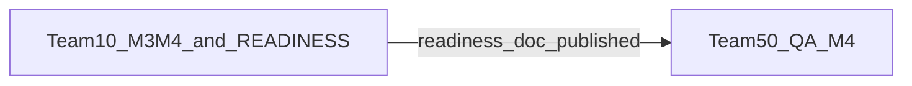

# M3 — חבילה 4: מימוש ישיר צוות **100** + רצף מנדטים **10 → 50**

**תאריך:** 2026-03-29  
**מוציא:** צוות **100** (אורקסטרציה)  
**נמענים:** נימרוד (בעל מוצר), צוותי **10, 50**  
**תלות:** [`M3-Q1-6-WAIVER-PARALLEL-M4-GATE-TEAM100-2026-04-08.md`](./M3-Q1-6-WAIVER-PARALLEL-M4-GATE-TEAM100-2026-04-08.md) (**W-Q1-6-2026-04-08**)  
**תוכנית מסגרת:** [`M3-EXECUTION-PLAN-AND-MANDATES-TEAM100-2026-04-07.md`](./M3-EXECUTION-PLAN-AND-MANDATES-TEAM100-2026-04-07.md) — חבילה 4, §2.4

---

## 1. חובות מימוש ישיר צוות **100** — ביקורת והשלמה

| # | משימה | סטטוס | הוכחה במאגר |
|---|--------|--------|-------------|
| A1 | Waiver פורסם עם מזהה **W-Q1-6-2026-04-08** | **הושלם** | [`M3-Q1-6-WAIVER-PARALLEL-M4-GATE-TEAM100-2026-04-08.md`](./M3-Q1-6-WAIVER-PARALLEL-M4-GATE-TEAM100-2026-04-08.md) |
| A2 | יומן + §2.4 + §4 משקפים חבילה 4, **QA-M4**, waiver | **הושלם** | [`M3-EXECUTION-PLAN-AND-MANDATES-TEAM100-2026-04-07.md`](./M3-EXECUTION-PLAN-AND-MANDATES-TEAM100-2026-04-07.md) — שורות חבילה 4, **QA-M4**, פרסום חבילה 4, §4 |
| A3 | תיק governance מקושר ל־waiver; **G5–G7** ב־**בביצוע 10** | **הושלם** | [`../team_10/M3-M2-GOVERNANCE-BACKLOG-TEAM10-TO-TEAM100-2026-04-01.md`](../team_10/M3-M2-GOVERNANCE-BACKLOG-TEAM10-TO-TEAM100-2026-04-01.md) — טבלה + עדכון 2026-04-08 |
| A4 | מנדטי **M3-M4** ו־**QA-M4** פורסמו | **הושלם** | [`../team_10/M3-M4-VISUAL-POLISH-MANDATE-TEAM10-2026-04-08.md`](../team_10/M3-M4-VISUAL-POLISH-MANDATE-TEAM10-2026-04-08.md) · [`../team_50/M3-QA-M4-VISUAL-NOTE-MANDATE-TEAM50-2026-04-08.md`](../team_50/M3-QA-M4-VISUAL-NOTE-MANDATE-TEAM50-2026-04-08.md) |

**חתימת סגירת מימוש ישיר (100):** כל סעיפי A1–A4 אומתו במאגר נכון ל־**2026-03-29**. מסמך זה הוא רישום קנוני לסגירת שלב האורקסטרציה לפני העברת הביצוע ל־10 ו־50.

---

## 2. רצף ביצוע חובה בין צוותים (**10 → 50**)

**שלב 1 — צוות 10:** מימוש **M3-M4** (קוד, פריסה סטייג’ינג) + פרסום **READINESS** — [`../team_10/M3-QA-M4-READINESS-REQUEST-TEAM10-2026-04-01.md`](../team_10/M3-QA-M4-READINESS-REQUEST-TEAM10-2026-04-01.md) (דגימות URL + רשימת שינויים) + ארטיפקט פריסה ומסירת שלב 1 ל־100 — ראו **§5**.

**שלב 2 — צוות 50:** **רק לאחר** שקובץ ה־READINESS מ־10 פורסם במאגר — הרצת **QA-M4** ופרסום דוח **`M3-QA-M4-VISUAL-NOTE-REPORT-TEAM50-YYYY-MM-DD.md`**.

---

## 3. מקבילות בתוך צוות **10** (לפי waiver)

לפי [`M3-Q1-6-WAIVER-PARALLEL-M4-GATE-TEAM100-2026-04-08.md`](./M3-Q1-6-WAIVER-PARALLEL-M4-GATE-TEAM100-2026-04-08.md), **G5–G7** (כפילויות REST ל־`lectures`, `sound-healing`, `workshops`) יכולים להתקדם **במקביל** ל־**M3-M4** — כל זה **באחריות צוות 10**, בלי לדחות את אחד מהם «עד אחרי» השני.

הרצף ב§2 נוגע **רק** לכך ש־**50** לא פותח **QA-M4** לפני **READINESS** מ־**10**.

---

## 4. מנדטים לביצוע ברצף — תצוגת העברה לנימרוד

| סדר | צוות | מנדט / חובה | קישור |
|-----|------|-------------|--------|
| **1** | **10** | **M3-M4** + **READINESS**; במקביל **G5–G7** + **R1–R4** (לפי תיק והגשה חוזרת QA-2) | [`M3-M4-VISUAL-POLISH-MANDATE-TEAM10-2026-04-08.md`](../team_10/M3-M4-VISUAL-POLISH-MANDATE-TEAM10-2026-04-08.md) · [`M3-M2-GOVERNANCE-BACKLOG-TEAM10-TO-TEAM100-2026-04-01.md`](../team_10/M3-M2-GOVERNANCE-BACKLOG-TEAM10-TO-TEAM100-2026-04-01.md) · [`M3-QA-2-READINESS-RESUBMISSION-TEAM10-2026-04-08.md`](../team_10/M3-QA-2-READINESS-RESUBMISSION-TEAM10-2026-04-08.md) |
| **2** | **50** | **QA-M4** (אחרי שלב 1) | [`M3-QA-M4-VISUAL-NOTE-MANDATE-TEAM50-2026-04-08.md`](../team_50/M3-QA-M4-VISUAL-NOTE-MANDATE-TEAM50-2026-04-08.md) |

---

## 5. נספח — ארטיפקטי **שלב 1** (צוות **10**, 2026-04-01)

| מסמך | תפקיד |
|------|--------|
| [`../team_10/M3-QA-M4-READINESS-REQUEST-TEAM10-2026-04-01.md`](../team_10/M3-QA-M4-READINESS-REQUEST-TEAM10-2026-04-01.md) | בקשת מוכנות ל־**QA-M4** |
| [`../team_10/M3-M4-STAGING-DEPLOY-VERIFY-TEAM10-2026-04-01.md`](../team_10/M3-M4-STAGING-DEPLOY-VERIFY-TEAM10-2026-04-01.md) | פריסת FTP + דגימות `curl` + אימות `ea-m4-polish` |
| [`../team_10/M3-M4-STAGE1-HANDOFF-TEAM10-TO-TEAM100-2026-04-01.md`](../team_10/M3-M4-STAGE1-HANDOFF-TEAM10-TO-TEAM100-2026-04-01.md) | מסירה ל־**100** לפני דוח **QA-M4** מ־50; **סגירת מנדט M3-M4 מלאה** אחרי `M3-QA-M4-VISUAL-NOTE-REPORT-TEAM50-*.md` |

---

## 6. אחרי **ריטסט QA-M4** קנוני (**PASS**)

קליטת צוות **100** + **שלב הבא** (יתרות M3, לא סגירת אבן דרך מלאה בלי קריטריונים): [`M3-QA-M4-RETEST-ACCEPTANCE-AND-NEXT-PHASE-TEAM100-2026-04-07.md`](./M3-QA-M4-RETEST-ACCEPTANCE-AND-NEXT-PHASE-TEAM100-2026-04-07.md) · יומן [`M3-EXECUTION-PLAN-AND-MANDATES-TEAM100-2026-04-07.md`](./M3-EXECUTION-PLAN-AND-MANDATES-TEAM100-2026-04-07.md) **§2.5**.

---

**צוות 100** — אורקסטרציה M3
