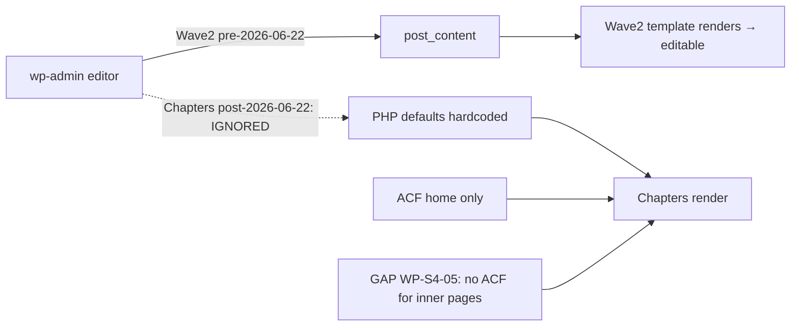
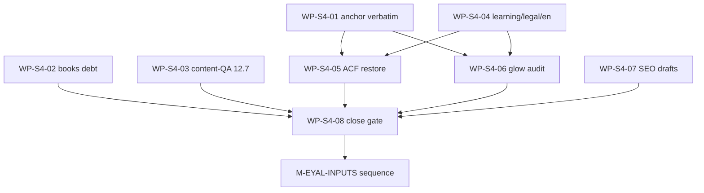

# S004 — רצף חבילות למסירה סופית לאייל: אינדקס-אב (LOD400)

## 0. מטרה, מבנה, וסטטוס

מסמך-אב יחיד (SSOT) לרצף החבילות שיביא את אתר הבדיקה (uPress staging) למצב **מסירה סופית לאייל לפני עלייה לאוויר**: ללא תירוצים, חוסרים, בגים או אי-דיוקים; כל העמודים עובדים ומלאים; כל תוכן חסר-מאייל מסומן בבירור בצבע זוהר; והתוכן ניתן לעריכה ב-wp-admin.

**שתי אבני-דרך:**
- **S004 — מוכנות למסירה (חבילות צוותיות).** אין תלות בחומרים/החלטות אייל. חייבות להסתיים לפני המסירה.
- **M-EYAL-INPUTS — ממתין לאייל.** רצף חבילות שכל אחת נעולה לחומר/החלטה מאייל; החיווט (placeholder זוהר) כבר במקום ב-S004, כך שהקליטה = החלפה, לא בנייה.

**מבנה התוצרים:**
- מסמך-אב זה (אינדקס + מטריצת כיסוי + גרף תלויות + תוכנית ולידציה).
- מסמך LOD400 נפרד לכל WP: `_COMMUNICATION/team_100/S004/WP-S4-0N-LOD400-2026-07-15.md` · `_COMMUNICATION/team_100/M-EYAL-INPUTS/WP-EI-0N-LOD400-2026-07-15.md`.
- רישום ב-`_aos/roadmap.yaml` (file-SSoT / ADR034 R8, כמו WP-CANON).
- סנכרון Hub `eyal-pending.json` לרצף M-EYAL-INPUTS.

**הרף (זהה ל-WP-CANON-LOD400):** כל spec מפורט מספיק כדי שכל מפתח ג'וניור או agent טרי יוכל לממש בלי פערים, ניחושים או הנחות — קבצים, פונקציות, שורות, קריטריוני-קבלה מדידים.

---

## 1. ממצא-על מחייב: דריפט עריכת התוכן ב-wp-admin (אושר בקוד)

זהו הדריפט החמור שהמשתמש הצביע עליו («כבר היה לנו עריכת תוכן לרוב עמודי האתר — בדקתי ידנית בדפדפן»). האימות בקוד:

1. `ea_chapters_field()` / `ea_chapters_rows()` / `ea_chapters_img()` ב-[site/wp-content/themes/ea-eyalamit/inc/chapters/chapters-render.php](site/wp-content/themes/ea-eyalamit/inc/chapters/chapters-render.php) מחזירים ערך ACF כשקיים, אחרת seeded default. המנגנון תומך ב-override מלא.
2. קבוצת שדות ACF רשומה **רק לדף הבית** — [acf-fields-home.php](site/wp-content/themes/ea-eyalamit/inc/chapters/acf-fields-home.php). זהו קובץ ה-ACF היחיד שהיה אי-פעם (`git log --all -- '*acf-fields*'` → רק home, 2 קומיטים).
3. לפני מיגרציית Chapters (2026-06-22) האתר רץ על תבניות Wave2 שהגישו `post_content` → כל עמוד היה **נערך ב-wp-admin** (עורך בלוקים/קלאסי). זה מה שאייל ראה.
4. המיגרציה העבירה את מסלול ההגשה ל-`inc/chapters/defaults/*-defaults.php` (מקודד ב-PHP) שמתעלם מ-`post_content` ומ-ACF → **העריכה נעלמה בשקט** לכל עמודי Chapters מלבד הבית.
5. החלטת team_00 מ-2026-06-22 (`Option B` — ACF פנימי לכל העמודים) **מעולם לא יושמה**.

**מסקנה ארכיטקטונית:** עמודי הפנים בנויים כמערך `sections` הטרוגני (סוגי `part`: `prose/split/steps/reveals/bleed/videoblk/dd/testimonials/faqblock/cta/gallery/phero`). שחזור העריכה אינו טריוויאלי כמו הבית (שם המבנה קבוע וידוע) — נדרשת הכרעת מודל-שדות מקדימה (LOD300 בתוך WP-S4-05).

---

## 2. אבן-דרך S004 — חבילות צוותיות (רצף מחייב)

| WP | כותרת | תלוי-ב | בעלים בנייה | ספק ולידציה | מסמך LOD400 |
|----|-------|--------|-------------|--------------|-------------|
| WP-S4-01 | עוגן /snoring-sleep-apnea/ verbatim (18 סקשנים) | — | team_10/team_110 | team_90 (cross-engine) | `S004/WP-S4-01-LOD400-2026-07-15.md` |
| WP-S4-02 | סגירת חוב ספרים (גלריות, GI זמני, FAQ seed) | — | team_10 | team_50 E2E | `S004/WP-S4-02-LOD400-2026-07-15.md` |
| WP-S4-03 | סגירת Content-QA 12.7 בדפדפן (ראיות) | — | team_50/team_90 | team_90 | `S004/WP-S4-03-LOD400-2026-07-15.md` |
| WP-S4-04 | learning + משפטי + /en — תוכן צוותי | — | team_10/team_30 | team_50 | `S004/WP-S4-04-LOD400-2026-07-15.md` |
| WP-S4-05 | **שחזור עריכה wp-admin (ACF Option B)** | S4-01, S4-04 | team_110 | team_90 (cross-engine) | `S004/WP-S4-05-LOD400-2026-07-15.md` + `WP-S4-05-LOD300-FIELD-MODEL-2026-07-15.md` |
| WP-S4-06 | ביקורת placeholder זוהר כלל-אתרית | S4-01, S4-04 | team_10 | team_50 | `S004/WP-S4-06-LOD400-2026-07-15.md` |
| WP-S4-07 | טיוטות SEO/GEO צוותיות (AF-01..04, FAQ-02/03, BLOG) | — | team_30 | team_90 | `S004/WP-S4-07-LOD400-2026-07-15.md` |
| WP-S4-08 | שער סגירה: QA מלא + פריסה + חבילת מסירה לאייל | S4-01..07 | team_50 | team_190 | `S004/WP-S4-08-LOD400-2026-07-15.md` |

### 2.1 היקף «עמודים חשובים» ל-WP-S4-05 (טעון אישור אייל)
- **כלול:** home (קיים), method, treatment, snoring-sleep-apnea, sound-healing, lessons, eyal-amit(about), mokesh-dahiman, didgeridoos, bags, stands-storage, stand-floor, repair, shop, books(muzza), vekatavta, kushi-blantis, tsva-bekahol, faq(hero/intro), contact.
- **מועמדי החרגה (טעון אישורך):** `/en` (מחרוזות hardcoded/נדחה D-EYAL-EN-BODY-02), qr-hub (מונע-דאטה), galleries/media (מונעי-קטלוג). שאלות FAQ עצמן כבר נערכות דרך CPT `ea_faq` — רק ה-hero/intro של `/faq` נכנס להיקף.

---

## 3. אבן-דרך M-EYAL-INPUTS — ממתין לאייל (נעול לאבן-הדרך הבאה)

| WP | כותרת | חומר/החלטה נדרשים מאייל | placeholder קיים? |
|----|-------|--------------------------|-------------------|
| WP-EI-01 | URL חשבונית ירוקה מדויק — 3 ספרים + 5 מוצרים | קישורי Morning/GI per-item | כן (כפתור GI זמני mrng.to/MTUiO3vkIg) |
| WP-EI-02 | גלריות ספרים + מוצר — תמונות אמיתיות | 2–3 תמונות לכל פריט (Drive/וואטסאפ) | כן (סלוטי «ממתין לאישור») |
| WP-EI-03 | מדיית + ניסוח עוגן | צילום מכבי, סיפור/תמונת יוני, אישור ניסוח רפואי | כן (סלוטי «ממתין») |
| WP-EI-04 | מוקש דהימן — אישור סופי + תמונות | אישור/עריכה + תמונות הנצחה | לא-חוסם (חי verbatim) |
| WP-EI-05 | נוסח משפטי סופי | פרטיות/נגישות/תקנון מאושר | כן (טיוטת S4-04) |
| WP-EI-06 | גוף /en | אישור תקציר אנגלי | כן (טיוטת S4-04) |
| WP-EI-07 | אצירת 48 עדויות + תצוגה; GA4/Clarity | אישור/עריכה per-item + מזהי מדידה | כן (מרקיזה חיה) |

---

## 4. מטריצת כיסוי פערים (מקור: ביקורות 2026-07-15 + DRIFT 2026-07-14 + Hub)

| פער פתוח | מקור | חבילה מכסה |
|----------|------|-------------|
| עוגן stub ≠ verbatim מלא | AUDIT §1, GATE-FAILED | WP-S4-01 |
| מדיית עוגן (מכבי/יוני) | AUDIT §1, eyal-pending | WP-EI-03 |
| גלריות וכתבת/צבע לא-מלאות | COMPLETION Track B | WP-S4-02 (סלוטים) + WP-EI-02 (תמונות) |
| GI URLs מדויקים | DRIFT, eyal-pending OPEN-GI-* | WP-EI-01 |
| דריפט Mendele → GI זמני | DRIFT | סגור ב-S4-02 (אימות) |
| Content-QA 12.7 ללא browser QA ייעודי | AUDIT §1 P0 | WP-S4-03 |
| /learning/* placeholder בלבד | AUDIT §1, §2 | WP-S4-04 (תוכן צוותי) |
| עמודים משפטיים placeholder | AUDIT §1, eyal-pending OPEN-LEGAL | WP-S4-04 (טיוטה) + WP-EI-05 (אישור) |
| /en ללא גוף | eyal-pending OPEN-EN-BODY | WP-S4-04 (טיוטה) + WP-EI-06 (אישור) |
| **עריכת wp-admin חסרה (הדריפט)** | AUDIT §3 | **WP-S4-05** |
| meta-box מחיר מוצר | AUDIT §1 P2 | WP-S4-05 |
| placeholder זוהר לא-אחיד כלל-אתר | הוראת המשתמש | WP-S4-06 |
| SEO/GEO drafts AF/FAQ/BLOG | AUDIT §1 P1, content-proposals | WP-S4-07 |
| מוקש אישור סופי | eyal-pending OPEN-MOKESH | WP-EI-04 |
| עדויות 48 + GA4/Clarity | eyal-pending OPEN-CHAPTERS-TESTIMONIALS, WP-W2-01 | WP-EI-07 |
| קבלת ליד — טפסי יצירת קשר (CF7/מייל) + fallback wa.me/tel: + מדידת generate_lead | VERDICT team_90 C90-01 | WP-S4-08 §חלק G (contact/lead) |
| QA מלא + פריסה + מסירה | הוראת המשתמש | WP-S4-08 |

**אין פער פתוח ללא בעלות.** `/press` (Wave2 בכוונה) מחוץ להיקף — מעקב נפרד לפי החלטת WP-CANON §0.2.

---

## 5. גרף תלויות רצף הבנייה

עצמאיים ויכולים לרוץ מיידית: WP-S4-01, WP-S4-02, WP-S4-03, WP-S4-04, WP-S4-07. WP-S4-05/06 ממתינים ל-01/04. WP-S4-08 הוא שער-סגירה.

---

## 6. ולידציה (חובה — חוצת-מנוע, Iron Rule #1)

לאחר כתיבת כל מסמכי ה-LOD400, סוכן-משנה במנוע **שונה** ממנוע המחבר (Claude → gpt-5.2/grok) מבצע:
1. **buildability** — לכל LOD400: קבצים/פונקציות/שורות מדויקים, AC מדידים, spec_ref פנימי, בעלות צעד-הבא, ללא TBD.
2. **כיסוי פערים עמוק** — כל שורה במטריצה §4 ממופה לחבילה קיימת ובעלת LOD400 קביל; אין פער יתום; אין חבילה כפולה.
3. **hygiene (ידני — דטרמיניסטי)** — הסקריפט `scripts/lint_constitutional_package.py` **אינו קיים במאגר זה**; לכן בדיקה ידנית לפי הצ'ק-ליסט: (א) `grep -L 'date: 2026-07-15' <docs>` = ריק (כל מסמך נושא את התאריך הקאנוני, לא עתידי); (ב) `grep -c 'phase_owner: team_100'` ≥ 1 בכל מסמך (לא placeholder כמו RECEIVING_TEAM); (ג) כל מסמך נושא frontmatter מלא (`id`/`wp`/`lod_status`/`next_wp`). כשייווצר סקריפט לינט קנוני במאגר — להחליף את הבדיקה הידנית בהרצתו.

פלט: `_COMMUNICATION/team_90/VERDICT-S004-LOD400-COVERAGE-2026-07-15.md` (טבלת ממצאים עם evidence-by-path + route_recommendation).

---

## 7. רישום ב-roadmap (spec לביצוע ב-todo roadmap-register)

- שתי רשומות milestone חדשות בהערת ה-project.notes + רשומות WP לכל 15 החבילות תחת `work_packages:` ב-`_aos/roadmap.yaml`.
- כל WP: `id`, `label`, `status: PLANNED`, `track: BUILD`, `current_lean_gate: L-GATE_SPEC`, `lod_status: LOD400` (ל-S4) / `LOD400` (ל-EI), `milestone_ref: S004`/`M-EYAL-INPUTS`, `spec_ref` למסמך ה-LOD400, `blocked_by` לפי §5, `roadmap_mutation: 'ADR034 R8 file-SSoT'`.
- **לפני mutation:** health probe (`curl $AOS_API_BASE/api/system/health`) — אם online, לרשום שהמוטציה file-SSoT מכיוון שה-L0 roadmap ב-API stale (כמו WP-CANON).

---

## 8. שרשרת ביצוע רציפה + פרוטוקול הנדאוף קאנוני (חובה)

מטרה (הוראת team_00 2026-07-15): כל סשן של team_110 (או הצוות המבצע) שמסיים חבילה יֵדע **בדיוק** מה החבילה הבאה, יבצע **הנדאוף קאנוני מדויק**, ויציג אותו ל-team_00 לניתוב ויצירת הסשן הבא — **בלי** להתחיל את החבילה הבאה אוטומטית.

### 8.1 סדר-ביצוע לינארי (מכבד תלויות)
כל חבילה נושאת `next_wp` בפרונטמטר של מסמך ה-LOD400 שלה. השרשרת ל-S004:

| # | חבילה | `next_wp` |
|---|-------|-----------|
| 1 | WP-S4-01 (עוגן) | WP-S4-04 |
| 2 | WP-S4-04 (learning/משפטי/en) | WP-S4-02 |
| 3 | WP-S4-02 (ספרים) | WP-S4-03 |
| 4 | WP-S4-03 (Content-QA 12.7) | WP-S4-07 |
| 5 | WP-S4-07 (SEO drafts) | WP-S4-05 |
| 6 | WP-S4-05 (שחזור עריכה ACF) | WP-S4-06 |
| 7 | WP-S4-06 (סימון זוהר) | WP-S4-08 |
| 8 | **WP-S4-08 (בקרה סופית + פריסה + מסירה)** | M-EYAL-INPUTS |

M-EYAL-INPUTS (WP-EI-01..07): **מאגר** ולא שרשרת — כל חבילה נעולה לקלט אייל ומתבצעת עם קבלתו (בכל סדר). `next_wp` שלהן = «N/A — triggered by Eyal input»; בסיום כל אחת — הנדאוף ל-team_00 לפי §8.2.

**`next_wp` נמצא בשני מקומות (SSOT כפול-מקור, מיושר):** (א) בפרונטמטר של כל מסמך WP (קריא-מכונה); (ב) בשדה `next_wp` של כל רשומת WP ב-`_aos/roadmap.yaml`. ה-handoff footer בתחתית כל מסמך משכפל את הערך לקריאה אנושית. הערכים זהים בכל שלושת המקומות.

**LOD300 של WP-S4-05** (`WP-S4-05-LOD300-FIELD-MODEL-2026-07-15.md`) הוא **prerequisite תיעודי** של WP-S4-05 בלבד — הוא **אינו** פריט-שרשרת נפרד ולכן אינו רשום כ-WP עצמאי ב-roadmap; הוא מופיע כ-`parent_lod300` ברשומת WP-S4-05.

### 8.2 פרוטוקול ההנדאוף הקאנוני (SSOT: hub prompt-generate API)
בסיום חבילה (`L-GATE_BUILD PASS` מתועד), הסשן המבצע חייב, לפי `.cursorrules` §AOS Handoff (לא לשכפל את ההרכבה מקומית):
1. **להפיק הנדאוף** דרך `GET {AOS_API_BASE}/api/prompts/generate?type=onboard_agent&mode=handoff&team_id=110&wp_id={next_wp}&gate_state=gate_done&next_gate=L-GATE_VALIDATE&session_summary=...&accomplishments=...&blockers=...`.
2. **לכתוב** את `artifact_markdown` verbatim ל-`_COMMUNICATION/team_110/HANDOFF_SELF_{NUM}_{CONTEXT}_{DATE}_v1.md`. **כלל החלפת placeholders (חובה — אין להשאיר תבנית):** `{NUM}` = מספר רץ (ספרו קבצי `HANDOFF_SELF_*` קיימים ב-`_COMMUNICATION/team_110/` והוסיפו 1, מרופד ל-3 ספרות, למשל `001`); `{CONTEXT}` = ה-`wp_id` של החבילה שהסתיימה (למשל `WP-S4-01`); `{DATE}` = תאריך הסשן בפועל מ-`hub/data/calendar-anchor.txt` בפורמט `YYYY-MM-DD`.
3. **להציג** את `activation_block` **inline בצ'אט** ל-team_00 (נמרוד) — ADR032 v1.2.0 — לניתוב ויצירת הסשן הבא.
4. **לא** להתחיל את `next_wp` אוטומטית — לעצור ולהמתין לניתוב team_00.
5. אם ה-API לא זמין: לעצור, להנחות את המשתמש להעלות את שרת ה-hub, ולא להרכיב הנדאוף ידנית (מונע drift מול ה-SSoT).

### 8.3 בקרה סופית (WP-S4-08) — הדרישה המחייבת
WP-S4-08 היא חבילת **בקרה ובדיקה סופית, מלאה ומעמיקה** של כלל התיקונים (A: re-check WP-S4-01..07), כלל העמודים (B: כל route — זמינות/רינדור/דיוק/SEO), **כלל ממשקי העריכה** (C: מחזור override→fallback ב-wp-admin לכל עמוד חשוב — חוסם מסירה), הסימון הזוהר (D), פריסה (E), וחבילת מסירה לאייל ב-docx/PDF (F). שער סופי `L-GATE_VALIDATE` ע"י team_190 (חוקתי, cross-engine). ספק מלא: `S004/WP-S4-08-LOD400-2026-07-15.md`.
