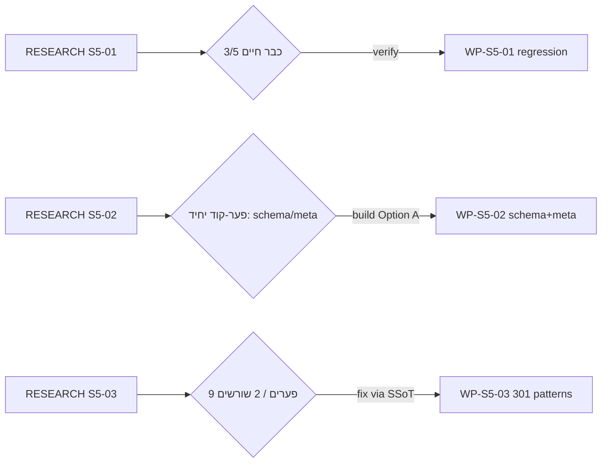
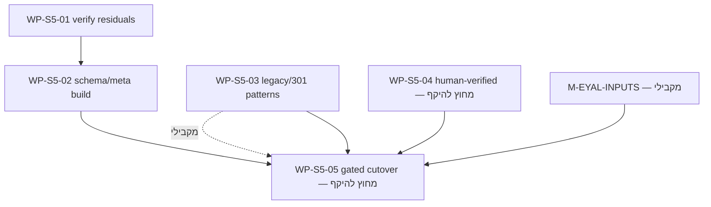

# S005 — חבילות 1+2+3 (WP-S5-01/02/03): אינדקס-אב (LOD400)

## 0. מטרה, מבנה, וסטטוס

מסמך-אב יחיד (SSOT) לשלוש החבילות הראשונות של אבן-הדרך **S005 «Path to Production Cutover»**. שלושתן מביאות את שכבת ה-SEO/GEO/legacy של אתר הבדיקה (uPress staging) ל**שלמות מאומתת** לפני עלייה לאוויר (WP-S5-05, מחוץ להיקף חבילה זו).

**שלוש החבילות:**
- **WP-S5-01 — Quick-verify residuals.** 5 פריטי-שארית שהועברו מ-S003 הסגורה; רובם **כבר בנויים וחיים** — הספק הוא *אימות/regression*, לא בנייה.
- **WP-S5-02 — SEO/GEO ratified-execution completion.** הפער-הקוד האמיתי היחיד בחבילה: schema/meta ל-routes חסרי-כיסוי (Option A — index+schema). שאר הפריטים כבר פתורים/רדומים.
- **WP-S5-03 — Legacy/301 completeness.** טריאז' מלא של 400 URL-ים לגאסי; 2 תבניות-תיקון מרוכזות (לא 400 בעיות נפרדות).

**מבנה התוצרים:**
- מסמך-אב זה (אינדקס + מטריצת כיסוי + גרף תלויות + תוכנית ולידציה + פרוטוקול הנדאוף).
- 3 מסמכי LOD400 נפרדים: `S005/WP-S5-01-LOD400-2026-07-16.md` · `S005/WP-S5-02-LOD400-2026-07-16.md` · `S005/WP-S5-03-LOD400-2026-07-16.md`.
- עדכון `_aos/roadmap.yaml` (file-SSoT / ADR034 R8): `lod_status: LOD200 → LOD400` + `spec_ref` חדש + `parent_index` ל-3 החבילות.

**הרף (זהה לכל LOD400 קודם בפרויקט — S004 / WP-CANON):** כל spec מפורט מספיק כדי שכל מפתח ג'וניור או agent טרי יוכל לממש בלי פערים, ניחושים או הנחות — קבצים, פונקציות, שורות, קריטריוני-קבלה מדידים.

**מקור האמת לתוכן:** 3 מסמכי מחקר קרקע-אמת (2026-07-16), שכולם השתמשו בקריאת קוד ישירה + curl חי מול הסטייג'ינג:
- `_COMMUNICATION/team_100/RESEARCH-WP-S5-01-GROUND-TRUTH-2026-07-16.md`
- `_COMMUNICATION/team_100/RESEARCH-WP-S5-02-GROUND-TRUTH-2026-07-16.md`
- `_COMMUNICATION/team_100/RESEARCH-WP-S5-03-GROUND-TRUTH-2026-07-16.md`

---

## 1. ממצא-על מחייב: רוב ה«שאריות» כבר בנויות — העבודה מרוכזת, לא מפוזרת

בניגוד ל-S004 (שהיה רובו בנייה), **S005 חבילות 1-3 הוא רובו אימות**. המחקר החי הוכיח:

1. **WP-S5-01:** 3 מתוך 5 הפריטים כבר תקינים לחלוטין בקוד החי (באג pagination תוקן, FAQ-TOC בנוי ומרונדר, חנות בתפריט) → הספק = **regression/confirm**, לא build. פריט QR עובר בסטייג'ינג אך הסיכון prod-only. פריט route-completeness = **verify-only** (התיקון עצמו ב-WP-S5-02).
2. **WP-S5-02:** sitemap כבר מיושר; QR-iframe lazy-load כבר חי (46/46); כלל Offer-price תקין ורדום. **פער-הקוד האמיתי היחיד** = schema/meta ל-`/press/` + `/shows-heritage/` + 48 QR + hub.
3. **WP-S5-03:** לא 400 בעיות — **9 פערים אמיתיים ב-2 שורשים** (תחילית-לגאסי שנייה לא-ממופה; נתיבי `/shop/books/*` חסרים), הניתנים לתיקון בבת-אחת דרך ה-SSoT.

**מסקנה תכנונית:** המפרטים ממסגרים במפורש כל פריט כ-`VERIFY` / `BUILD` / `CONTENT-TASK` / `CUTOVER-GATED`, כדי ש-team_110 לא יבזבז מאמץ-בנייה על מה שכבר קיים.

---

## 2. שלוש החבילות (רצף מחייב + בעלויות)

| WP | כותרת | תלוי-ב | בעלים בנייה | ספק ולידציה (spec) | מסמך LOD400 |
|----|-------|--------|-------------|---------------------|-------------|
| WP-S5-01 | Quick-verify residuals (5 פריטים, רובם verify) | — | team_10 | team_90 (cross-engine, Iron Rule #1) | `S005/WP-S5-01-LOD400-2026-07-16.md` |
| WP-S5-02 | SEO/GEO completion — schema/meta (Option A) | **WP-S5-01** | team_10 | team_90 (cross-engine) | `S005/WP-S5-02-LOD400-2026-07-16.md` |
| WP-S5-03 | Legacy/301 completeness (טריאז' 400 URL) | — (מקבילי) | team_10 | team_90 (cross-engine) | `S005/WP-S5-03-LOD400-2026-07-16.md` |

**מקבילות:** WP-S5-01 ו-WP-S5-03 עצמאיים לחלוטין (`blocked_by: []`) — יכולים לרוץ במקביל ומיידית. WP-S5-02 חסום ע"י WP-S5-01 (`blocked_by: [WP-S5-01]`) — כי ה-verify של פריט 5 ב-S5-01 מאשר את רשימת ה-routes המדויקת ש-S5-02 מתקן. שלושתן מזינות את שער ה-cutover **WP-S5-05** (מחוץ להיקף אפיון זה).

### 2.1 החלטת אינדוקס QR/routes (Option A — אושר team_00 2026-07-16)
ה-routes חסרי-ה-schema (`/press/`, `/shows-heritage/`, 48× `/qr/qrN/` + hub `/qr/`) → **index מלא + schema/meta ייעודי** (לא noindex):
- **48 QR + hub:** ענף `qr` חדש ב-`ea-w2-seo-schema.php` הפולט `Article` + `VideoObject` (כשמוטמע YouTube) / `Article` בלבד אחרת + meta-description אוטומטי מ-`post_content` של כל עמוד.
- **`/press/` + `/shows-heritage/`:** node `Article`/`CollectionPage` + כניסת meta ב-`inc/seo-head-fallbacks.php`.
- **fallback מתועד (לא שער-פתוח):** noindex נשאר היפוך זול והפיך פוסט-cutover אם GSC Coverage יראה thin-content. המפרט בר-בנייה במלואו כפי שהוא.

---

## 3. מטריצת כיסוי פערים (מקור: 3 מסמכי RESEARCH 2026-07-16)

| # | פער / פריט | מקור-אמת (RESEARCH) | חבילה מכסה | מסגור | AC (תמצית) |
|---|-------------|----------------------|-------------|--------|-------------|
| 1 | באג blog pagination (`/blog/page/N/`) | S5-01 §Item1 | WP-S5-01 | **VERIFY** (כבר תוקן) | `/blog/page/2..5` = 200, סטי-פוסטים שונים, marker `current` נכון, מול `tpl-chapters-blog-archive.php` |
| 2 | FAQ section-TOC | S5-01 §Item2 | WP-S5-01 | **VERIFY** (כבר בנוי) | ‎#chips == קטגוריות-עם-שאלות; כל `#faq-topic-*` יש target |
| 3 | חנות בתפריט הניווט | S5-01 §Item3 | WP-S5-01 | **VERIFY** (כבר קיים) | 6 hrefs (hub /shop/ + 5 מסלולי-מוצר) בתוך `<nav id="nav">` (`section-nav.php:36-46`) |
| 4 | QR direct-200 (49 שורות) | S5-01 §Item4 | WP-S5-01 | **VERIFY + prod-only caveat** | 49 שורות direct-200 בסטייג'ינג; חובה re-run פוסט-cutover ל-302 prod |
| 5 | route-completeness schema/meta | S5-01 §Item5 = S5-02 §Item2 (**אותו ממצא**) | **WP-S5-02** (בעלים) / WP-S5-01 (verify-only) | **BUILD (Option A)** | ראה #7-#9 |
| 6 | sitemap URL reconciliation | S5-02 §Item1 | WP-S5-02 | **NO-OP** (מיושר, cutover-gated) | robots+301+GSC = `/sitemap_index.xml` — כבר מוסכם, עולה ב-cutover |
| 7 | schema/meta ל-`/press/` | S5-02 §Item2 | WP-S5-02 | **BUILD** | node `Article`/`CollectionPage` + meta ב-`$map`; עובר Rich Results |
| 8 | schema/meta ל-`/shows-heritage/` (תיקון השם מ-`/shows/`) | S5-02 §Item2 | WP-S5-02 | **BUILD** | node + meta; המפרט מתקן `/shows/`→`/shows-heritage/` |
| 9 | schema/meta ל-48 QR + hub | S5-02 §Item2 | WP-S5-02 | **BUILD (Option A)** | ענף `qr` → `Article`+`VideoObject`+auto-meta; index; עובר Rich Results על מדגם |
| 10 | QR-iframe CWV (facade/lazy/transcript) | S5-02 §Item3 | WP-S5-02 | **PARTIAL** (lazy כבר חי) | reset `ea_w2_07_qr_seeded_v3` + re-seed ל-nocookie; החלטת facade+transcript |
| 11 | Offer/price schema rule | S5-02 §Item4 | WP-S5-02 | **CONTENT-TASK** (קוד תקין ורדום) | אימות `is_numeric()` gate; מחיר נכנס דרך metabox — לא תיקון-קוד |
| 12 | טריאז' 400 legacy URL | S5-03 §Step1-3 | WP-S5-03 | **BUILD** | 400 URL מסווגים keep-200/301/410; שיטת map-check+curl |
| 13 | תחילית-לגאסי שנייה `דיגרידו-סטודיו-…-2/*` | S5-03 §Step3 | WP-S5-03 | **BUILD** | חוקים ממופים במראה לתחילית המכוסה, דרך SSoT |
| 14 | נתיבי `/shop/books/*` חסרים | S5-03 §Step3 | WP-S5-03 | **BUILD** | `/shop/books/*` → `/books/*` נוספים ל-135-decision SSoT |
| 15 | 54 הפניות-בלוג per-slug (TODO פתוח) | S5-03 §Step4 | WP-S5-03 | **BUILD/DECIDE** | לקפל אמיתיים ל-SSoT או לאשר שאין ערך לשימור (GSC/traffic) |
| 16 | `/פסח/`-class orphans | S5-03 §Step3 | WP-S5-03 | **BUILD** | 410, לא 301-לשומקום |
| 17 | www/scheme + orphaned-blog-destination | S5-03 §Step3 | WP-S5-03 | **OUT-OF-STAGING-SCOPE** | מסומן במפורש כבלתי-נבדק בסטייג'ינג; נבדק על prod (WP-S5-05) |

**אין פער פתוח ללא בעלות. אין פער כפול-בעלות** — ראה §3.1.

### 3.1 פתרון החפיפה S5-01 ↔ S5-02 (מחייב — נבדק בוולידציה)
פריט 5 של S5-01 (route-completeness) **והוא-הוא** פריט 2 של S5-02 = אותו ממצא master-plan §8 item 7. **בעלות התיקון = WP-S5-02 בלבד** (חבילת ה-SEO/GEO-completion). **WP-S5-01 נושא מסגור verify-only** (מאשר את רשימת ה-routes ומאמת שהתיקון תפס לאחר בנייה) — **לא בונה, לא מכפיל**. זו הסיבה ל-`blocked_by: [WP-S5-01]` על S5-02.

---

## 4. גרף תלויות רצף הבנייה

עצמאיים ומיידיים: **WP-S5-01, WP-S5-03** (`blocked_by: []`). **WP-S5-02** ממתין ל-S5-01. כולם מזינים את **WP-S5-05** (שער ה-cutover, חסום ע"י S5-01..04 + M-EYAL-INPUTS — לא חלק מאפיון זה).

---

## 5. ולידציה (חובה — חוצת-מנוע, Iron Rule #1)

לאחר כתיבת שלושת מסמכי ה-LOD400 + עדכון ה-roadmap, סוכן-משנה במנוע **שונה** ממנוע המחבר (Claude → composer-2.5 / cursor vendor) מבצע, דרך `scripts/run_cross_engine_validation.sh team_90 . <mandate_path>` (Path A):
1. **buildability** — לכל LOD400: קבצים/פונקציות/שורות מדויקים, AC מדידים, spec_ref פנימי, בעלות next_wp, ללא TBD.
2. **כיסוי פערים** — כל שורה במטריצה §3 ממופה לחבילה בעלת LOD400 קביל; אין פער יתום; **אין פער כפול** (חפיפה §3.1 נבדקת במפורש).
3. **עקביות `next_wp`** — זהה בין frontmatter כל WP, `_aos/roadmap.yaml`, וטבלת §7 (כמו שנבדק ל-S004 cycle3).
4. **hygiene דטרמיניסטי** — תאריך קאנוני `2026-07-16`, frontmatter מלא, אין placeholder.

**Iron Rule #1 מתקיים אוטומטית:** builder = Claude (team_100), validator = composer-2.5 (non-Claude, team_90).
פלט: `_COMMUNICATION/team_90/VERDICT-S005-LOD400-COVERAGE-2026-07-16.md`. **מעגל תיקון עד PASS נקי (0 findings)** — כמו S004 cycle3.

---

## 6. רישום ב-roadmap (spec לביצוע)

עדכון file-SSoT (ADR034 R8, כי roadmap ה-L0 ב-API stale — health probe תחילה) לשלוש רשומות WP קיימות ב-`_aos/roadmap.yaml`:
- `lod_status: LOD200 → LOD400`.
- `spec_ref` → מסמך ה-LOD400 החדש של כל WP (במקום ה-`spec_ref` הזמני הנוכחי לאינדקס S004 / WP-W2-17).
- הוספת `parent_index: _COMMUNICATION/team_100/S005/S005-PACKAGE-1-3-INDEX-2026-07-16.md`.
- **ללא שינוי** ל-`next_wp`, `blocked_by`, `status` הקיימים (נשמרים כפי שהם, מיושרים ל-frontmatter).
- כותב לוגי יחיד (Iron Rule #4). אימות parse: `python3 -c "import yaml; yaml.safe_load(open('_aos/roadmap.yaml'))"`.

---

## 7. שרשרת ביצוע + פרוטוקול הנדאוף קאנוני (חובה)

### 7.1 שרשרת `next_wp` (מיושרת ל-roadmap הקיים)

| # | חבילה | `next_wp` (frontmatter = roadmap = כאן) | הערה |
|---|-------|------------------------------------------|------|
| 1 | WP-S5-01 (verify residuals) | **WP-S5-02** | חוליית-פתיחה; ההנדאוף לצוות 110 נפתח כאן |
| 2 | WP-S5-02 (schema/meta build) | **WP-S5-05** | חסום ע"י S5-01; מזין את שער ה-cutover |
| — | WP-S5-03 (legacy/301) | **WP-S5-05** | **מקבילי-עצמאי** — לא בשרשרת הלינארית; team_00 מנתב במקביל |

**`next_wp` נמצא בשלושה מקומות מיושרים:** frontmatter כל מסמך WP · שדה `next_wp` ב-`_aos/roadmap.yaml` · הטבלה הזו. הערכים זהים (נבדק בוולידציה §5.3).

### 7.2 פרוטוקול ההנדאוף (SSOT: hub prompt-generate API)
בסיום אפיון+ולידציה נקייה, team_100 (סשן זה) מפיק הנדאוף בנייה קאנוני **לחבילה הפותחת WP-S5-01**:
1. **הפקה** דרך hub prompt-generate API: `type=onboard_agent&mode=handoff&team_id=110&wp_id=WP-S5-01&gate_state=gate_done&next_gate=L-GATE_BUILD`.
2. **כתיבת** `artifact_markdown` verbatim ל-`_COMMUNICATION/team_110/HANDOFF_SELF_{NUM}_WP-S5-01_2026-07-16_v1.md` (`{NUM}` = ספירת `HANDOFF_SELF_*` קיימים ב-team_110 + 1, מרופד 3 ספרות).
3. **הצגת** `activation_block` **inline בצ'אט** ל-team_00 (נמרוד) — ADR032 — לניתוב ויצירת סשן הבנייה.
4. **לא** להתחיל בנייה. team_110 מתחיל רק אחרי ניתוב team_00.
5. אם ה-API לא זמין → לעצור, לא להרכיב הנדאוף ידנית (מונע drift מול SSoT).

WP-S5-03 (המקבילי) — team_00 יכול לנתב אותו לבנייה במקביל ל-S5-01/02, בהנדאוף נפרד, לפי החלטתו.
