# עץ אתר גרפי — סבב 2 · 2026-08-25

**צוות:** 100 · **גל:** 5 · **חוק:** אודות **לא** 301. איחוד חנות+תיקון = סימון בלבד. כל URL חי.

בסיס סטייג'ינג: `http://eyalamit-co-il-2026.s887.upress.link`

שאלות לאייל (גם בטרקר): [QUESTIONS-S006-R2-EYAL-REGISTER.md](file:///Users/nimrod/Documents/AOS_V5/EyalAmit.co.il-2026/_COMMUNICATION/team_100/S006/QUESTIONS-S006-R2-EYAL-REGISTER.md)

```mermaid
flowchart TD
  home["בית /"]
  about["אודות /about/  ★ E-R2-01"]
  eyal["אייל עמית /eyal-amit/  סבב 1 — לא נוגעים"]
  moksha["/about/moksha/  301 → מוקש לזכרו"]
  shop["חנות /shop/  סבב 1"]
  didg["כלים למכירה /didgeridoos/  סבב 1"]
  repair["תיקון /repair/  סבב 1  ★ E-R2-02 איחוד?"]
  tools["/tools-and-accessories/  301 → /shop/"]
  courses["קורסים חיצוניים /learning/courses-external/  ★ E-R2-03"]
  hist["כתבות /historical-articles/  ★ E-R2-04"]
  press["עיתונות /press/  ★ E-R2-04"]
  svc["שירותים /services/  ★ E-R2-04"]
  shows["הופעות /shows-heritage/  ★ E-R2-04"]
  ty["תודה /thank-you/  ★ E-R2-04"]
  qr["QR /qr/ + 48 ילדים מודפסים"]
  posts["54 פוסטים בבלוג"]
  acc["נגישות /accessibility/  E-R2-05 אחרי נימרוד"]
  priv["פרטיות /privacy/"]
  terms["תקנון /terms/"]
  home --> about
  home --> eyal
  about -.->|"לא 301"| eyal
  moksha --> eyal
  home --> shop
  shop --> didg
  shop --> repair
  tools --> shop
  home --> courses
  home --> hist
  home --> press
  home --> svc
  home --> shows
  home --> ty
  home --> qr
  home --> posts
  home --> acc
  home --> priv
  home --> terms
```

## URL חי לכל צומת ארכיון

| סימון | עמוד | URL חי |
|---|---|---|
| E-R2-01 | אודות (ביוגרפיה קצרה) | http://eyalamit-co-il-2026.s887.upress.link/about/ |
| E-R2-01 | אייל עמית (ארוך, סבב 1) | http://eyalamit-co-il-2026.s887.upress.link/eyal-amit/ |
| E-R2-02 | חנות / כלים / תיקון — לא ליישם איחוד | http://eyalamit-co-il-2026.s887.upress.link/shop/ · http://eyalamit-co-il-2026.s887.upress.link/didgeridoos/ · http://eyalamit-co-il-2026.s887.upress.link/repair/ |
| E-R2-03 | קורסים חיצוניים | http://eyalamit-co-il-2026.s887.upress.link/learning/courses-external/ |
| E-R2-04 | כתבות | http://eyalamit-co-il-2026.s887.upress.link/historical-articles/ |
| E-R2-04 | עיתונות | http://eyalamit-co-il-2026.s887.upress.link/press/ |
| E-R2-04 | שירותים | http://eyalamit-co-il-2026.s887.upress.link/services/ |
| E-R2-04 | הופעות | http://eyalamit-co-il-2026.s887.upress.link/shows-heritage/ |
| E-R2-04 | תודה | http://eyalamit-co-il-2026.s887.upress.link/thank-you/ |

אין המצאת תוכן ארכיון. אין 301 מאודות. 23 עמודי סבב 1 לא נערכו.
