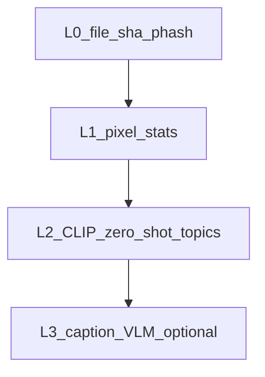

# שכבות ניתוח מדיה לאינדקס (Eyal Amit · צוות 40)

## הבעיה

סטטיסטיקות פיקסלים (בהירות, צבע דומיננטי, חדות) **לא** מספיקות כדי לשייך תמונה לעמוד, לנושא או להציע חלופות — חסרה **הבנה של מה מופיע בתמונה**.

## שכבות מומלצות (מלמטה למעלה)



| שכבה | מה נותנת | עלות | פרטיות |
|------|-----------|------|--------|
| **L0** | זיהוי כפילויות (SHA, pHash) | נמוכה | מלאה מקומית |
| **L1** | מימדים, EXIF, צבע/חדות | נמוכה | מלאה מקומית |
| **L2 CLIP** | התאמת תמונה ל**רשימת פרומפטים** (נושאים: ספר, במה, דיג'רידו, טבע…) + ציונים | בינונית (GPU/MPS מזרז) | מלאה מקומית |
| **L3 VLM** (Llava / GPT-4V / Gemini) | **משפט תיאור** בעברית, ישויות, פעולות | גבוהה / API | תלוי ספק |

## מה ממומש כעת במאגר

- **L1** — `build_index.py` → `index.json` (גרסה 2).
- **L2** — `semantic_enrich_clip.py` → **`index.v3.json`**: לכל רשומה נוסף `semantic_content` עם `top_labels` (פרומפט אנגלי + ציון), `topics_he_union`, `site_hooks_union` (מזהים לוגיים לצוות: `muzeh`, `didgeridoo`, …).

## איך משתמשים באינדקס לשילוב בעמודים

1. **לפי נושא בעברית:** חפש ב־`search.keywords` או ב־`meta.search.keyword_index` מפתחות כמו `ספרים`, `דיג'רידו`, `הופעה`.
2. **לפי פרק באתר (הוק):** חפש `site:muzeh`, `site:didgeridoo` וכו' (נוספו ב־merge מהשכבה הסמנטית).
3. **לפי ציון:** מיין לפי `semantic_content.top_labels[0].score` אחרי סינון לפי `topics_he_union`.

## שיפורים הבאים

1. **הרחבת `LABEL_DEFS`** ב־`semantic_enrich_clip.py` — פרומפטים ספציפיים יותר לספרים של אייל, למופעים, לסטודיו בפרדס חנה (לפי תוכן SSOT).
2. **L3 מקומי:** Ollama + `llava` / `qwen2-vl` ל־`caption_he` (משפט אחד) — לשמור `notes_source: vlm_local_v1`.
3. **API:** אם מאושר ענן — אצווה ל־Vision API עם JSON schema לתגיות בעברית.

## דרישות התקנה (L2)

```bash
pip install -r requirements-semantic.txt
python3 semantic_enrich_clip.py --index index.json --mirror mirror --out index.v3.json
```

הרצה ראשונה תוריד משקלי מודל (OpenCLIP + LAION).
