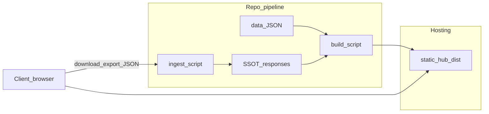

# אפיון פלטפורמת Hub לקוח — טיוטה (מוצר נפרד מנוהל הסביבה)

> **SUPERSEDED — למבנה ולסכימות Hub:** הנוהל הקנוני הארגוני הוא [`../../CLIENT_HUB_STANDARD_v1.md`](../../CLIENT_HUB_STANDARD_v1.md) (גוף הנוהל נעול). התאמות פרויקט Eyal: [`../../CLIENT_HUB_APPENDIX_EYAL.md`](../../CLIENT_HUB_APPENDIX_EYAL.md). מסמך טיוטה זה נשמר להקשר היסטורי ובהשוואת מוצר; **אין** להסתמך עליו במקום הנוהל הנעול.

**גרסה:** 0.2 (טיוטה)  
**תאריך:** 2026-04-09  
**סטטוס:** לא מחייב; הוחלף לעומת הנוהל ב־`docs/CLIENT_HUB_STANDARD_v1.md`.

**מטרה:** להגדיר את **Hub לקוח** כמוצר/פלטפורמה הניתנת לשכפול בין פרויקטים — מבנה, פיצ'רים, נתונים וזרימות **המוגבלות לתחום ה-Hub בלבד** — **בלי** לבלבל עם נוהל אירוח WordPress/uPress.

**היקף מסמך:** רק Hub (תוכן, מבנה, פריסה טכנית של ה-view, קליטת משוב). **אין** במסמך זה מודל צוותים ארגוני, מספור צוותים, שערים, או נוהלי עבודה כלליים של המאגר — אלה נשארים במסמכים נפרדים של כל פרויקט.

**מימוש ייחוס (דוגמה חיה):** [`../../../hub/`](../../../hub/) בשורש המאגר · נוהל view↔SSOT: [`../../../hub/EYAL-HUB-SSOT-WORKFLOW.md`](../../../hub/EYAL-HUB-SSOT-WORKFLOW.md) · נוהל קנוני: [`../../CLIENT_HUB_STANDARD_v1.md`](../../CLIENT_HUB_STANDARD_v1.md).

---

## 1. חזון ויעדים

| יעד | תיאור |
|-----|--------|
| **שקיפות** | הלקוח רואה במקום אחד: איפה הפרויקט בroadmap, מה נשלח אליו, ומה מחכה להחלטה. |
| **מעקב החלטות** | כל נושא שדורש בחירת לקוח מקבל מזהה יציב, הקשר, אפשרויות והשלכות — והתשובה נקלטת למאגר בצורה מבנית. |
| **הפחתת סבבים** | פחות "מה קורה?" ופחות איבוד הקשר בין מייל לווטסאפ לקבצים. |
| **הפרדה מהפורמלי** | Hub הוא **תצוגה ותיאום**; **אין** להחליף מסלול רשמי (למשל docx/PDF לחתימה) אלא **לשלב** אותו עם קישורים ומראה. |
| **שכפול** | אותו דפוס תיקיות, סכימות וסקריפטים (או תבנית מאוחדת עתידית) מתאימים לכל פרויקט חדש עם התאמות שמות ונתיבים. |

**לא בטווח המסמך:** כל מה שאינו Hub — כולל ארגון צוותים, בקרה, כלי עורך, ונתיבי דיווח פנימיים של הפרויקט.

---

## 2. הפרדה מנוהל הסביבה (uPress / v2)

הנוהל הארגוני [`UPRESS_WORDPRESS_STANDARD_v2.md`](../UPRESS_WORDPRESS_STANDARD_v2.md) מגדיר אירוח, FTP/FTPS, WordPress, REST, מטמון וכו'. **Hub לקוח אינו חלק מקובץ זה**; הוא מוצר עצמאי ש**נפרס** לרוב על אותו חשבון אירוח (תיקייה סטטית מחוץ לליבת WP או לצדה), ולכן **רק הטמעה טכנית** (נתיב FTP, TLS) מתיישרת עם v2 §12 והרחבות פרויקט (למשל משתנה `UPRESS_*_HUB_PATH`). **הערת v1.1:** צפיית Hub ציבורית — **ללא** Basic Auth על התיקייה; ראו [`CLIENT_HUB_STANDARD_v1.md`](../../CLIENT_HUB_STANDARD_v1.md).

| נושא | שייך ל־Hub (מוצר זה) | שייך לנוהל סביבה (v2 / runbooks) |
|------|------------------------|-------------------------------------|
| מבנה עמודים, JSON, ייצוא משוב | כן | לא |
| מזהי שאלות יציבים, סכימת קליטה | כן | לא |
| חיבור FTP/FTPS, `.env.upress`, פורט 21 | רק כדרישת פריסה | כן |
| Application Password, `/wp-json` לאתר WP | עקרונות אוטומציה (פרק 8) | כן (§7) |
| Docker מקומי, WP-CLI | לא חלק מה-Hub | כן (סביבת פיתוח) |

**כלל:** כשמעדכנים את **תוכן** ה-Hub — עורכים JSON/templates במאגר; כשמעדכנים **איך מעלים לשרת** — עוקבים אחרי v2 + runbook הפרויקט.

---

## 3. ארכיטקטורה לוגית (שכבות)

| שכבה | תפקיד | הערות |
|------|--------|--------|
| **View** | HTML/CSS/JS סטטי נבנה ממקור במאגר ונפרס לשרת | מה שהלקוח פותח בדפדפן; לא SSOT תפעולי בפני עצמו. |
| **מאגר תצוגה (data)** | קבצי JSON (שאלות, roadmap, עדכונים, דליברבלס) | נערך במאגר; גרסה ב-Git = מקור לבנייה. |
| **SSOT מקלט** | תיקייה במאגר לתשובות **אחרי קליטה מאומתת** (JSON + manifest) | בפער בין view לבין SSOT — **SSOT גובר**. |
| **קליטה (ingest)** | סקריפט שמאמת סכימה ומזהי שאלות וכותב ל־SSOT | ריצה מקומית/CI לפי נוהל הפרויקט. |
| **נכסים פורמליים** | docx/PDF במבנה קבוע במאגר (למשל `to-eyal/`) | לא מוחלפים ע"י Hub; Hub יכול לקשר או לשקף עותק לצפייה. |

זרימה טיפוסית: עדכון `data/*.json` במאגר → build → פריסה → לקוח ממלא ב־`pending` (או מקביל) → ייצוא JSON → העברה מאובטחת → `ingest` → commit ל־`responses/` → אופציונלית בנייה מחדש כדי לשקף סטטוס ב־view.

---

## 4. קטלוג פיצ'רים (גנרי) ורמת בגרות

### 4.1 ליבה — P0 (מומלץ לכל שכפול)

| מזהה | פיצ'ר | תיאור |
|------|--------|--------|
| F-01 | **דף בית (Hub)** | כניסה, סיכום קצר, קישורים לעמודים פנימיים ולעדכונים אחרונים. |
| F-02 | **Roadmap** | אבני דרך, מיקום נוכחי, פירוט רציף (למשל breakdown של שלב פעיל). |
| F-03 | **שאלות פתוחות** | רשימה; לחיצה פותחת פרטים (הקשר, אפשרויות, המלצה מקצועית, קישור מוקאפ). |
| F-04 | **עדכונים / לוג תקשורת קצר** | טקסטים קצרים מסודרים בזמן — מה נשלח, מה התקבל (ללא החלפת מייל). |
| F-05 | **דליברבלס** | קישורים למסמכים/גלים עם תיאור; תואם מבנה הגשה פורמלי בפרויקט. |
| F-06 | **ייצוא JSON יחיד** | מהדפדפן: קובץ אחד עם כל התשובות, חותמת זמן, גרסת סכימה. |
| F-07 | **ולידציה בקליטה** | דחיית קובץ עם מזהי שאלות לא קיימים או שדות חסרים. |
| F-08 | **אינדקס למנועי חיפוש** | `noindex,nofollow` על עמודי Hub; `robots.txt` חוסם היכן שמתאים. |

### 4.2 מומלץ — P0.5

| מזהה | פיצ'ר | תיאור |
|------|--------|--------|
| F-09 | **שיקוף קבצים ל־`dist/files/`** | העתקת docx/pdf/txt ממבנה קבוע במאגר כדי שקישורים בדליברבלס יעבדו אחרי פריסה. |
| F-10 | **מוקאפים סטטיים** | קישור משאלה ל־HTML תחת `dist/` (או נתיב יחסי) לבדיקת לקוח בלי WordPress. |

### 4.3 שלב שני — P1

| מזהה | פיצ'ר | תיאור |
|------|--------|--------|
| F-11 | **שמירת משוב בשרת** | endpoint (למשל PHP) שמקבל JSON ושומר ב־`incoming/` — מפחית חיכוך "הורדה→מייל→קליטה". |
| F-12 | **התראות** | אימייל/Webhook כשהוגש משוב (דורש תשתית ואבטחה). |

### 4.4 עתידי — P2

| מזהה | פיצ'ר | תיאור |
|------|--------|--------|
| F-13 | **דשבורד פנימי** | תצוגה לבעלי פרויקט בלבד (לא לקוח) — סטטוס שאלות ו-SLA; מימוש נפרד ממסמך זה. |

### 4.5 אבטחה ופרטיות (חוצה רמות)

- **הערת v1.1 (Eyal / נוהל נעול):** צפיית Hub **ללא** Basic Auth על התיקייה — ראו [`CLIENT_HUB_STANDARD_v1.md`](../../CLIENT_HUB_STANDARD_v1.md).
- **לא** לאחסן סיסמאות לקוח בקבצי JSON ב-Git.
- **GDPR/שמירת נתונים** — לפי מדיניות הפרויקט; Hub מצמצם PII למינימום הנדרש לתיאום.

---

## 5. מודל נתונים (גנרי)

### 5.1 שאלה (`questions` entry)

| שדה | חובה | תיאור |
|-----|------|--------|
| `id` | כן | מזהה יציב גלובלי בפרויקט; מומלץ קידומת `Q-<PROJECT>-<NN>` או דומה. |
| `title` | כן | כותרת קצרה ללקוח. |
| `context` | מומלץ | רקע והחלטה נדרשת. |
| `optionsText` | מומלץ | אפשרויות מנוסחות (א׳ ב׳ ג׳ או טקסט חופשי). |
| `implications` | אופציונלי | מה קורה אם בוחרים כל כיוון. |
| `recommendation` | אופציונלי | המלצה מקצועית (לא מחייבת את הלקוח). |
| `mockupHref` | אופציונלי | קישור יחסי למוקאפ תחת `dist/`. |
| `defaultStatus` | אופציונלי | למשל `awaiting_client` / `answered`. |

### 5.2 ייצוא משוב (קובץ מהדפדפן)

חובה לכלול לפחות:

- `schemaVersion` (מספר שלם)
- `exportType` (מחרוזת קבועה לסוג ייצוא, למשל `client-feedback`)
- `exportTimestamp` (ISO-8601)
- `answers[]` — לכל שאלה: `id` תואם ל־`questions`, ולפחות אחד מ־`choice` / `notes` / שדות נוספים שמוגדרים בפרויקט

קליטה נכשלת אם `id` לא קיים ב־`questions.json` או חסר שדה חובה לפי הסכימה.

### 5.3 קבצי לוויין

- **roadmap.json** — מבנה גמיש לפרויקט; מומלץ שדות: שלבים, תאריכים משוערים, `currentFocus`, `currentFocusBreakdown`.
- **updates.json** — רשומות עם תאריך וכותרת וגוף קצר.
- **deliverables.json** — פריטים עם כותרת, תיאור, קישור לקובץ או לגל.

---

## 6. שכפול לפרויקט חדש (ערכת התנעה)

צ'קליסט מומלץ (ללא צורך לערוך קובצי משילות חיצוניים):

1. **העתקת מבנה** — `data/`, `src/` (תבניות HTML, CSS, JS), `metadata` אם קיים.
2. **שמות וקידומות** — החלפת קידומת מזהי שאלות, כותרות, מזהה `exportType` אם רלוונטי.
3. **תיקיית SSOT** — למשל `docs/project/<client>-ssot/responses/` + `manifest.json`.
4. **סקריפטים** — `build_*_client_hub.py`, `ftp_publish_*`, `ingest_*_feedback_json.py` (או גנריזציה עתידית לשם אחיד).
5. **סביבה** — משתני נתיב Hub ב־`.env` הפרויקטי (הפניה לנוהל אירוח; לא לשכפל את v2 לתוך ה-Hub).
6. **גילוי במאגר** — לפי מוסכמות הפרויקט: קישור מנקודת הכניסה התיעודית אל מיקום ה-Hub ואל נוהל ה-workflow הספציפי (ללא חובה לציין כאן שמות קבצים ארגוניים).
7. **קאנון תקשורת** — מסמך ברמת הפרויקט שמגדיר מה חייב להיות docx/PDF לעומת מה רק ב-Hub.

---

## 7. תפעול Hub — תפקידים לוגיים (ללא מודל צוותים)

המסמך **אינו** מקשר לצוותים ממוספרים או לארגון. להלן רק **פעולות** הנדרשות לחיי Hub תקינים; מי מבצע אותן נקבע בנוהל נפרד של כל מאגר.

| פעולה | תיאור קצר |
|--------|-----------|
| **עריכת תוכן** | עדכון `data/*.json` (שאלות, roadmap, עדכונים, דליברבלס). |
| **בנייה** | הרצת סקריפט build ליצירת `dist/`. |
| **פריסה** | העלאת `dist/` לשרת לפי נוהל האירוח. |
| **קליטת משוב** | הרצת ingest על קובץ JSON שהלקוח ייצא; עדכון `responses/` + manifest. |
| **בדיקה לפני מסירה** | וידוא עמודים, ייצוא, `robots`/noindex — לפי [`CLIENT_HUB_STANDARD_v1.md`](../../CLIENT_HUB_STANDARD_v1.md). |

**אבטחה:** לא לאחסן סיסמאות או מפתחות בקבצי JSON של ה-Hub ב-Git; פרטי FTP/REST — רק במקומות סודיים המוגדרים בנוהל האירוח.

---

## 8. REST, אוטומציה וסביבת פיתוח

- **Hub עצמו** אינו דורש WordPress; אוטומציה סביב **האתר** (ייבוא תוכן, בדיקות) נשענת על REST/WP-CLI/Docker לפי שלב הפרויקט.
- **בשלב פיתוח:** Application Password, משתני REST ב־`.env` מקומי (בפרויקט Eyal: ראו v2 §7 ו־[`../EYAL_ENV_VARS_REFERENCE.md`](../EYAL_ENV_VARS_REFERENCE.md) §2); סקריפטי smoke (למשל `verify_upress_rest.py`).
- **בפרודקשן (אחרי נעילה):** הקשחה — צמצום הרשאות, ביטול מפתחות זמניים, כפי שמוגדר בנוהל הפרויקט — **מחוץ** למסמך Hub זה.

---

## 9. Roadmap מוצר Hub (פלטפורמה)

| שלב | תוכן |
|-----|------|
| **P0** | סטטי מלא + ייצוא JSON + ingest + SSOT + noindex (ל־Eyal: ללא Basic Auth על צפייה — נוהל נעול). |
| **P1** | שמירה בשרת; התראות; שיפורי נגישות ו-i18n לפי צורך. |
| **P2** | דשבורד פנימי; איחוד סקריפטי build/publish בין פרויקטים (CLI אחד עם קונפיג). |

---

## נספח א׳ — מיפוי ליישום Eyal Amit 2026

| פיצ'ר (סעיף 4) | מיקום / כלי במאגר |
|-----------------|-------------------|
| F-01–F-05 (עמודים + נתונים) | [`../../../hub/data/`](../../../hub/data/) · [`../../../hub/src/`](../../../hub/src/) · פלט [`../../../hub/dist/`](../../../hub/dist/) |
| F-06–F-07 (ייצוא + ולידציה) | [`../../../scripts/ingest_eyal_feedback_json.py`](../../../scripts/ingest_eyal_feedback_json.py) + [`../../../hub/src/assets/feedback.js`](../../../hub/src/assets/feedback.js) |
| SSOT מקלט | [`../../../hub/ssot/`](../../../hub/ssot/) — `responses/`, `manifest.json` |
| Build + פריסה | [`../../../scripts/build_eyal_client_hub.py`](../../../scripts/build_eyal_client_hub.py) · [`../../../scripts/ftp_publish_eyal_client_hub.py`](../../../scripts/ftp_publish_eyal_client_hub.py) |
| F-09 (שיקוף קבצים) | `build_eyal_client_hub.py --mirror-docs` (או `--mirror-docx`) |
| F-11 (אופציונלי) | [`../../../hub/src/incoming/`](../../../hub/src/incoming/) |
| נוהל תקשורת רשמית מול לקוח (פרויקט Eyal) | [`../eyal-ceo-submissions-and-responses/EYAL-CORRESPONDENCE-CANON.md`](../eyal-ceo-submissions-and-responses/EYAL-CORRESPONDENCE-CANON.md) |
| אוטומציית פרסום במאגר Eyal (כלי עזר, מחוץ להיקף אפיון Hub) | [`.cursor/skills/eyal-client-hub-publish/SKILL.md`](../../../.cursor/skills/eyal-client-hub-publish/SKILL.md) |

---

## נספח ב׳ — מונחים

| מונח | משמעות |
|------|--------|
| **Hub** | ממשק סטטי מופנה ללקוח לתיאום ומעקב. |
| **View** | מה שנבנה ל־`dist/` ונפרס. |
| **SSOT (מקלט משוב)** | JSON מאושר אחרי ingest — לא כל קובץ במאגר. |

---

*סוף טיוטה — להערות ומשוב בעלי עניין בפרויקט; מסמך זה אינו כולל מודל צוותים ארגוני.*
