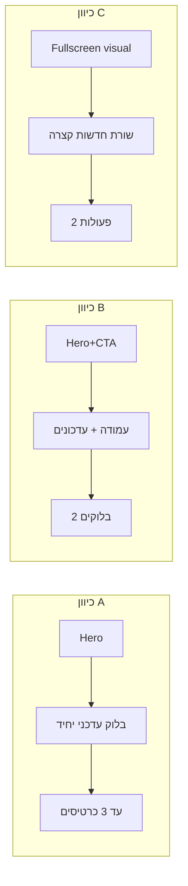

# שלושה כיוונים לדף הבית — v1.2 (סכמה + הסבר)

**תאריך:** 2026-03-30  
**עקרונות נימרוד:** מינימליסטי; תמונה גדולה; מקום **אחד בולט** לתוכן עדכני + עד **2–3** משניים; לא "עיתון יומי".

---

## כיוון A — "שער אחד"

```text
+------------------------------------------+
|  [ Hero — תמונה / וידאו קצר full-width ] |
+------------------------------------------+
|  בלוק חדשות ראשיות (אירוע / קמפיין)      |  <- אזור עדכני מרכזי אחד
+------------------------------------------+
| [כרטיס קטן] [כרטיס קטן] [כרטיס קטן]      |  <- עד 3 משניים (שירות / בלוג / קורסים)
+------------------------------------------+
|  פוטר                                   |
+------------------------------------------+
```

**רעיון:** מבקר מבין תוך שניות **מה קורה עכשיו**; שאר האתר דרך תפריט.

---

## כיוון B — "מרכז + עומק"

```text
+------------------------------------------+
|  Hero צר יותר + משפט מסר + CTA ראשי      |
+--------+---------------------------------+
| צד     |  אזור עדכני (רשימה קצרה /       |
| תפריט  |  "הבא בתאריך…")                 |
| משני   +---------------------------------+
| (אופצי)|  2 בלוקים שווים — למשל שירות +  |
|        |  המלצה אחת                      |
+--------+---------------------------------+
```

**רעיון:** מרגיש יותר "מרכז מקצועי"; עדיין מעט אלמנטים.

---

## כיוון C — "תמונה דומיננטית + שכבה"

```text
+------------------------------------------+
|                                          |
|     תמונה / וידאו רקע כמעט מסך מלא       |
|     טקסט קצר + CTA על השכבה            |
|                                          |
+------------------------------------------+
|  שורה אחת — "מה חדש" (שורה או שתיים)   |
+------------------------------------------+
|  שני כפתורים / כרטיסים בלבד              |
+------------------------------------------+
```

**רעיון:** הכי מינימליסטי; מתאים למותג אישי חזק; פחות מקום ל"חדשות" — מתאים אם העדכונים נדירים.

---

## Mermaid — השוואה זרימתית



---

**לאייל:** לסמן כיוון מועדף (או "שילוב: ___") לפני אפיון ויזואלי מלא.
